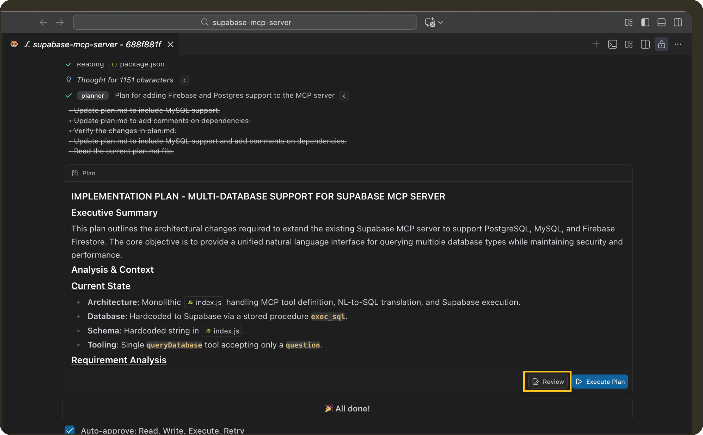
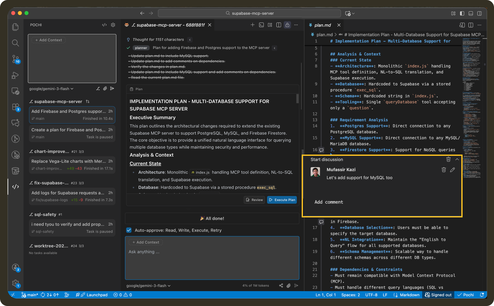
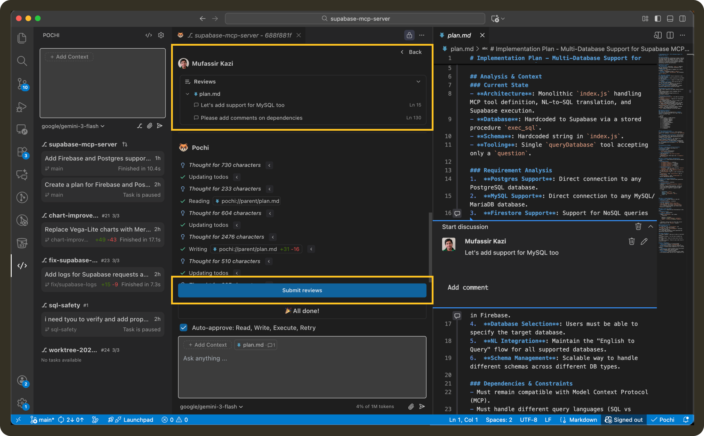
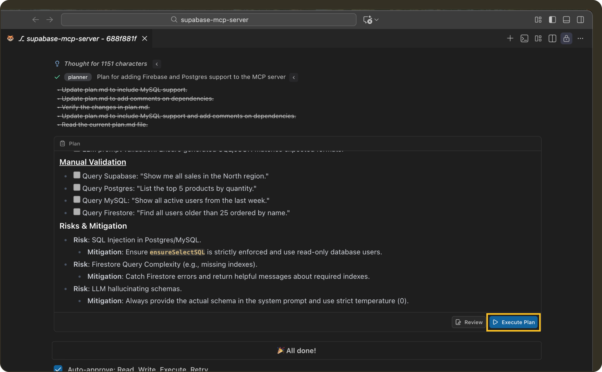

# Create Plan Mode

Create Plan mode lets you generate and refine an implementation plan before Pochi makes any code changes.

Instead of immediately editing files, the agent explores your workspace and produces a structured plan as a workspace file (`plan.md`). You can review the plan, leave inline comments, refine assumptions, and only start execution once you’re aligned on the approach.

<video
        controls
        style={{
        width: "100%",
        borderRadius: "8px",
        boxShadow: "0 4px 12px rgba(0, 0, 0, 0.15)",
        }}
    >
        <source src="https://assets.docs.getpochi.com/create-plan.mp4" type="video/mp4" />
        Your browser does not support the video tag.
    </video>

## When to Use Create Plan

Create Plan is especially helpful for refactors or large feature work and even for tasks involving new dependencies or migrations. This is because changes like these can affect multiple parts of the systems and it’ll be wise if you review scope and risks first. 

For small, obvious changes, you can still use normal tasks that go straight to execution.

## How to Use Create Plan

### 1. Create a Plan Task
Open the task sidebar and describe what you want to build or change. Instead of normal execution mode click on “Plan” button when hovering over the send icon. 

Pochi will create a new task, refine you prompt based on your existing codebase, and generate a plan.

### 2. Review the Plan
Next, you can click on the “Review” button to open the plan as a workspace file (`plan.md`). 

You can read through the proposed steps and assumptions, leave inline comments on specific parts of the plan and edit the text directly if you want to refine wording or scope.

### 3. Refine and Iterate

After commenting or editing you can ask Pochi to update or refine the plan. It will revise the plan based on your feedback.

You can repeat this until you’re satisfied with the approach.

### 4. Start Execution
When the plan looks good, proceed to click on “Execute” in the task panel. Pochi will begin implementing the plan and applying code changes.

From this point, the task behaves like a normal execution task, and you can continue reviewing code with diffs and inline comments.

## Notes
* Create Plan does not modify code until execution is explicitly started.
* Large plans may take longer to generate due to workspace exploration.
* The quality of the plan depends on how clearly the goal is described.

## Best Practices

It’s great to use Create Plan for tasks where scope or approach is unclear. As the plan progresses, be explicit in comments when you want to change direction or constraints.

Ideally treat the plan like a design review: focusing on risks, edge cases and sequencing. Once execution starts, you can continue using reviews to guide further iterations.
