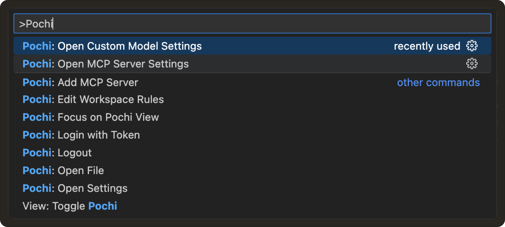
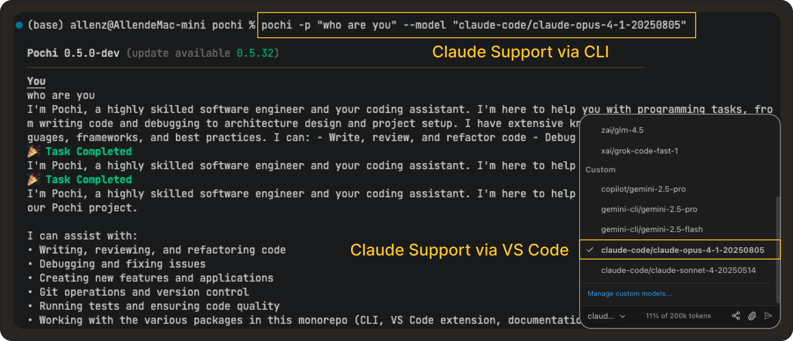

# Weekly Update #5

#### TL;DR

This release focuses on making Pochi more powerful across environments. We’ve added MCP support in the CLI, enabled Github Copilot and Claude Pro/Max authentication, and brought powerful extensibility and completions to your workflows. 

We’ve also added a self-hostable data sync backend (Livestore), a new manual sub-task execution mode, and key security and stability improvements. 🙌 

#### 🚀 Features

- **MCP support in CLI:** The CLI now supports running your Model Context Protocol (MCP) servers, allowing you to connect your tools, and run MCP-powered workflows directly from the terminal. This update brings the CLI closer to parity with the VS Code extension. **[#100](https://github.com/TabbyML/pochi/issues/100)**

  <iframe
    src="https://drive.google.com/file/d/1V8Ut_XXM9sRdSPHhoGVhMMnJHkxeaYFp/preview"
    style={{
      position: "absolute",
      top: 0,
      left: 0,
      width: "100%",
      height: "100%",
      border: "none",
      borderRadius: "8px",
    }}
    allowFullScreen
    title="MCP Support in CLI"
  />

- **Reveal Settings in VS Code Config Commands:** Pochi’s VS Code commands now let you jump directly to the relevant configuration section, rather than opening raw settings files. Just hit `Cmd+Shift+P` and search for "Pochi: Settings". **[#301](https://github.com/TabbyML/pochi/issues/301)**

- **GitHub Copilot Integration:** We’ve added support for authenticating GitHub Copilot in the CLI. This ensures users with active subscriptions can now use Copilot completions and suggestions inside Pochi’s terminal workflows. **[#184](https://github.com/TabbyML/pochi/issues/184)**

  <iframe
    src="https://drive.google.com/file/d/1I5nIr75CAgD5gQmPkRdw0q8bdcvs0P6S/preview"
    style={{
      position: "absolute",
      top: 0,
      left: 0,
      width: "100%",
      height: "100%",
      border: "none",
      borderRadius: "8px",
    }}
    allowFullScreen
    title="Github Copilot Integration"
  />

- **Gemini Model Support:** Added support for PDF and video inputs, enabling richer multimodal workflows with Gemini models. **[#219](https://github.com/TabbyML/pochi/issues/219)**

- **Claude Pro / Max Authentication:** We’ve now added support for users to connect their existing Claude Pro/Max subscriptions via OAuth for both CLI and VSCode. **[#61](https://github.com/TabbyML/pochi/issues/61), [#306](https://github.com/TabbyML/pochi/issues/306)** 
  

- **Self-hostable Data Sync Backend (Livestore):** We've implemented a self-hostable data sync backend that integrates with Pochi's Livestore architecture, allowing you to deploy your own sync backend and web sharing experience. **[#37](https://github.com/TabbyML/pochi/issues/37)**

#### ✨ Enhancements

- **Manual Execution Mode for Sub-Tasks:** Sub-tasks created with `newTask` can now be run in a manual, step-by-step mode avoiding large unmoderated changes to your codebases in your sensitive workflows. **[#300](https://github.com/TabbyML/pochi/issues/300)**

  <iframe
    src="https://drive.google.com/file/d/1AwiwI9uIv4Rf_r1rolCLMW38wWVZHP2y/preview"
    style={{
      position: "absolute",
      top: 0,
      left: 0,
      width: "100%",
      height: "100%",
      border: "none",
      borderRadius: "8px",
    }}
    allowFullScreen
    title="Manual Execution for Sub-tasks"
  />

- **Malformed Custom Agents in VSCode Settings:** Previously ignored malformed agent files (e.g., with YAML parsing errors) are now displayed in the settings UI with a clear warning, making it easier to debug and fix broken custom agent configurations. **[#391](https://github.com/TabbyML/pochi/issues/391)**, **[#415](https://github.com/TabbyML/pochi/issues/415)**

- **GitHub Action Improvements:** We’ve packaged changes that introduced:
  - Vitest for testing infrastructure.
  - Added unit tests and snapshots for GitHub Action system prompt logic.
  - Updated imports and code organization for better maintainability. **[#362](https://github.com/TabbyML/pochi/issues/362)**

#### 🐞 Bug fixes

- **Sensitive Data Sanitization in Shared Sessions:** Fixed an issue where tool call inputs/outputs (e.g., readFile, applyDiff) were leaked in shared Livekit-CF sessions. Sensitive content is now redacted before being exposed via the share API. **[#409](https://github.com/TabbyML/pochi/issues/409)**, **[#418](https://github.com/TabbyML/pochi/issues/418)**
- **Custom OpenAI Models and `max_tokens`Error:** A recent OpenAI API change broke compatibility with custom models configured in Pochi, replacing `max_tokens` with `max_completion_tokens`. We’ve patched the integration so tasks now run smoothly with the new parameter. **[#13](https://github.com/TabbyML/pochi/issues/13)**

#### 📖 Resources

- [Learn How to Connect Pochi to Your Self-Hosted Tabby Server](https://docs.getpochi.com/tutorials/connect-to-tabby-server/)
- [Tutorial on Querying SQL in Natural Language With a Custom Supabase MCP Server](https://docs.getpochi.com/tutorials/supabase-mcp-server/)
