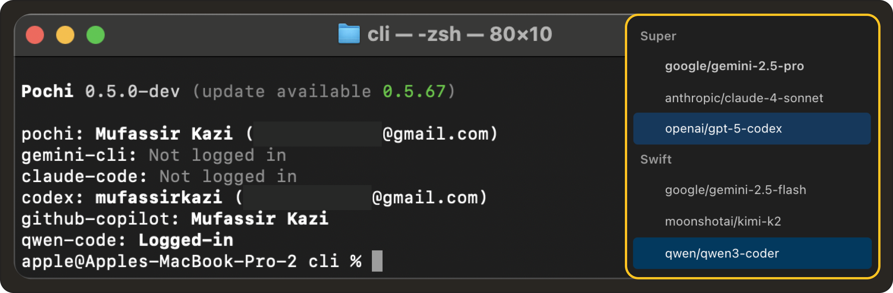

# Weekly Update #6

### TL;DR

Q4 is here, and Pochi’s cooking. 🍳

We’ve introduced vendor-level tooling for MCP with the new `webFetch` and `webSearch` integrations, added support for new AI vendors (**Codex** and **Qwen Coder**), and continued improving the VS Code experience with tabbed views and workspace-level configs.

And yes, webhook delivery is here too (finally!). Ping your favorite services in real time while making Pochi fit neatly into your CI/CD and automation setups.

Let’s roll.

### 🚀 Features

- **Webhook Delivery for Task Updates:**  Pochi can now send task update events to any external URL via webhooks, keeping your systems (Slack, Notion, custom dashboards or CI/CD pipelines) in sync. Just configure a `WEBHOOK_URL` to receive real-time notifications and automatically log, notify, or orchestrate actions whenever Pochi updates a task. **[#441](https://github.com/TabbyML/pochi/issues/441)**

- **Vendor Tools for MCP:** Pochi’s MCP got a major upgrade. It now supports vendor-level tooling, allowing Pochi to register capabilities that come bundled directly within the app. This allows different model vendors to expose their own tools alongside traditional MCP servers. The first built-in vendor tool introduced here is `webFetch`, a simple but powerful utility that allows AI agents to fetch and process web content. **[#447](https://github.com/TabbyML/pochi/issues/447)**

  <iframe
    src="https://drive.google.com/file/d/1Ad1BvIHacoxwyhScqv4qPsnSFEmeL_F6/preview"
    style={{
      position: "absolute",
      top: 0,
      left: 0,
      width: "100%",
      height: "100%",
      border: "none",
      borderRadius: "8px",
    }}
    allowFullScreen
    title="Manual Execution for Sub-tasks"
  />

- **New AI Vendor Support:** Following up on our vendor tool feature, Pochi  now supports Qwen Coder and Codex, adding new model vendors alongside Claude, Gemini, and Copilot. Additionally, we've introduced native compatibility with Anthropic’s API format, enabling faster and more stable integration with Claude models. **[#8](https://github.com/TabbyML/pochi/issues/8)**, **[#304](https://github.com/TabbyML/pochi/issues/304)**, **[#302](https://github.com/TabbyML/pochi/issues/302)** 

  

- **Open Pochi in a VS Code Tab:** Pochi can now be opened as a full editor tab (via Command Palette → `Pochi: Open in Editor`), giving you more room for conversations and workflows. You can split or move it like any regular file tab for a more flexible workspace. **[#378](https://github.com/TabbyML/pochi/issues/378)**

  <iframe
    src="https://drive.google.com/file/d/1zLxF-hM5MdaGSL0cCLQYITfeelMBGIYg/preview"
    style={{
      position: "absolute",
      top: 0,
      left: 0,
      width: "100%",
      height: "100%",
      border: "none",
      borderRadius: "8px",
    }}
    allowFullScreen
    title="MCP Support in CLI"
  />

### ✨ Enhancements

- **Workspace-Level Configuration:** We've added support for workspace-level `~/.pochi/config.jsonc` files, allowing teams to define project-specific settings that override global configurations. This allows your team to share custom MCP servers or model settings at the workspace level. **[#219](https://github.com/TabbyML/pochi/issues/219)**

- **Support for YAML Frontmatter** Workflow definitions now support YAML frontmatter, letting you specify metadata such as the preferred model directly within your `~/.pochi/workflows/*.md` files. This give you more control over which LLM handles each automation, especially if you’re balancing multiple providers. **[#343](https://github.com/TabbyML/pochi/issues/343)**

### 🐛 Bug fixes

- **Assistant Retry Logic:** Fixed an issue where assistant messages without tool calls were treated as new steps instead of retries, causing the retry count logic to behave incorrectly. **[#342](https://github.com/TabbyML/pochi/issues/342)**

- **Diff View in VS Code:** Files open before a diff operation are now reopened after accepting or rejecting changes, preserving your workspace layout. **[#440](https://github.com/TabbyML/pochi/issues/440)**

### 📖 Resources

- We’ve published a new tutorial: **[Build Your Own AI Teammate with Pochi in GitHub Actions](https://docs.getpochi.com/tutorials/pochi-github-actions/)**. Learn how Pochi reviews and gatekeeps PRs, enforces coding standards, opens issues, and even runs as a continuous background agent.

