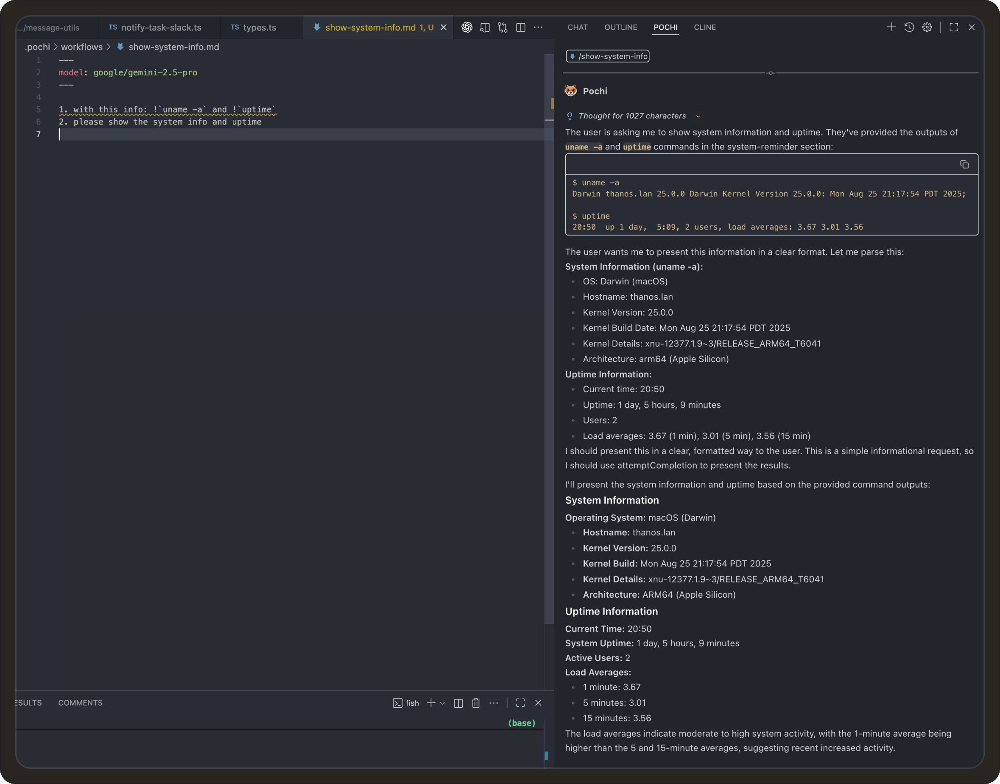
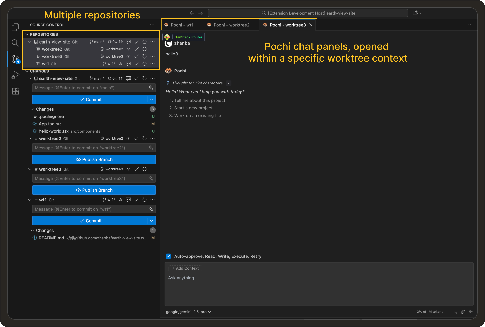

# Weekly Update #8

### TL;DR

We’ve given Pochi new tricks. 

Workflows can now execute Bash commands, `readFile` tool supports images, and markdown rendering is faster and cleaner with `streamdown.ai`.

A few quieter upgrades slipped in too: modular rules, Git subtree support, and a new Linux ARM64 release.

Let’s get on with it! 


### 🚀 Features


- **Bash Commands in Workflows** You can now execute Bash commands directly inside Pochi workflows using the `!` prefix. This allows workflows to pull live system or repository context, like `git status` or `uname -a`, and feed the results into the model before running your task. <break></break>
For example:
 ```bash
 - With this: !`uname -a` and !`uptime` 
 - Please show the system info and uptime
 ```
 Pochi automatically runs these commands and includes their outputs in the model’s context, making workflows more dynamic and connected to your local environment. **[#541](https://github.com/TabbyML/pochi/issues/541)**

<div class="w-12/15 md:ml-8 *:shadow-xl/30 *:rounded-lg"></div>

- **Git Worktree Integration:** You can now open and manage tasks from different Git worktrees directly in Pochi. Each worktree appears as its own context in the `Source Control` panel and can be opened in a dedicated Pochi tab. This is ideal if you’re working across multiple branches or release environments without leaving your main workspace. **[#226](https://github.com/TabbyML/pochi/issues/226)**, **[#533](https://github.com/TabbyML/pochi/issues/533)**

<div class="w-12/15 md:ml-8 *:shadow-xl/30 *:rounded-lg"></div>


### ✨ Enhancements


- **Faster Markdown Rendering with `streamdown.ai`:**  We’ve replaced `react-markdown` with `streamdown.ai` in the VS Code web UI. This upgrade improves performance, adds streaming-based markdown rendering, and ensures better support for rich content (like math, code blocks, and workflows). **[#401](https://github.com/TabbyML/pochi/issues/401)**


- **Image Support in `readFile` Tool:**  The `readFile` tool now supports reading image file inputs for multimodal models such as Gemini and Anthropic.  Pochi automatically detects file types and encodes images as `base64` for models that can interpret visual data. **[#539](https://github.com/TabbyML/pochi/issues/539)**, **[#569](https://github.com/TabbyML/pochi/issues/569)**

<div class="w-12/15 md:ml-8 *:shadow-xl/30 *:rounded-lg"></div>


- **Modular Rules with `@import` Syntax:** You can now split and organize large rule files by importing other markdown files using the `@` prefix (e.g. `@./rules/api-guidelines.md`). Pochi will stitch them together, managing complex configurations for your multi-agent or multi-project setups. **[#540](https://github.com/TabbyML/pochi/issues/540)**


<div
className="w-12/15 md:ml-8 *:shadow-xl/30 *:rounded-lg"
  style={{
    position: "relative",
    paddingBottom: "53.7%",
    marginBottom: 20,
    height: 0,
    overflow: "hidden",
    maxWidth: "100%",
  }}
>
  <iframe
    src="https://drive.google.com/file/d/18s3_3KyoA02aUefK7zmMJirWljW_QOFF/preview"
    style={{
      position: "absolute",
      top: 0,
      left: 0,
      width: "100%",
      height: "100%",
      border: "none",
      borderRadius: "8px",
    }}
    allowFullScreen
    title="Modular rules"
  />
</div>


- **Added Linux ARM64 Release:** Pochi is now available for Linux ARM64 systems, improving compatibility for developers running on Raspberry Pi or ARM-based environments. **[#543](https://github.com/TabbyML/pochi/issues/543)**
