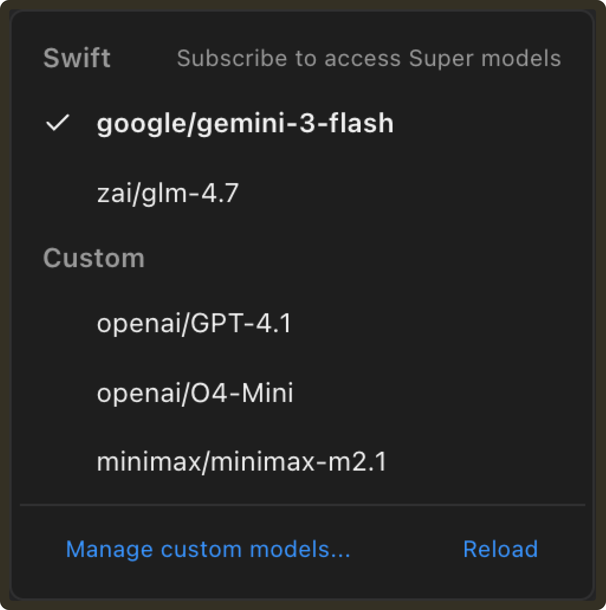

# Weekly Update #22

### TL;DR

This release is a collection of small but important fixes and refinements. 

We focused on correctness, clearer UI behavior, and better visibility into what agents are actually doing, along with a couple of pieces of writing that reflect how we think about safety in production.

### ✨ Enhancements

- **Expanded URL support for Google-based models:** Google-based models can now accept HTTP/HTTPS URLs and Google Cloud Storage (`gs://`) URLs as inputs, allowing them to process content from external sources more reliably. **[#1207](https://github.com/TabbyML/pochi/issues/1207)**

- **Updated model selection for subscription-based models:** Super Models are now hidden when a subscription is required, and a “Subscribe to access Super models” link is shown in the Swift Models group header, making upgrade paths clearer without cluttering the model list. **[#1204](https://github.com/TabbyML/pochi/issues/1204)**

### 🐛 Bug Fixes

- **Support symlinked directories in the skill loader:** Skills can now be loaded from symlinked directories in both the CLI and VS Code extension, which makes it easier to develop skills locally by symlinking them into `.pochi/skills`. **[#1199](https://github.com/TabbyML/pochi/issues/1199)**

- **Fixed task info loading when navigating between tasks:** Corrected task route initialization logic so task information loads and updates correctly when opening or switching between tasks in the VS Code UI. **[#1229](https://github.com/TabbyML/pochi/issues/1229)**

### 📖 Resources

- **How to give coding agents access to SSH and databases without breaking production:** We published a deep dive on why common safety patterns like command allowlists, SQL filters, and approval dialogs fail with autonomous agents, and why safety must be enforced at the infrastructure and execution layer instead of through prompts or behavioral controls. **[Read blog](https://docs.getpochi.com/developer-updates/ssh-database-access/)**

- **Secure production database access in Pochi:** Following our earlier post on agent safety, we released a hands-on guide showing how to grant agents controlled database access using isolated environments and gated deployment flows, without exposing production credentials or allowing uncontrolled writes. **[Read tutorial](https://docs.getpochi.com/tutorials/secure-db-access-in-pochi/)**