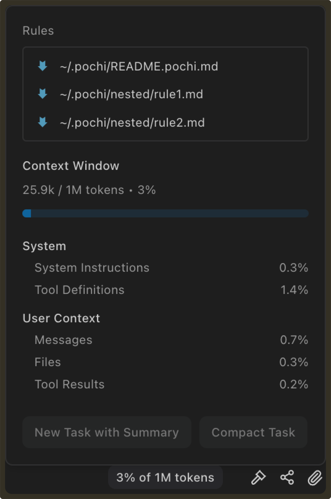

# Weekly Update #25

### TL;DR

This release introduces several improvements to how you interact with Pochi tasks and extend the agent with skills.

Highlights include a detailed context window breakdown, a new toggleable Plan Mode, and built-in skills for discovering and creating new skills. We’ve also made parallel worktrees and command execution more reliable.

Let's dive in!

### 🚀 Features

- **Context window usage breakdown:** The context window panel now shows a detailed breakdown of token usage during a task.   
 
  Previously, the UI only displayed total token usage and a progress bar. It was difficult to understand which parts of the context were contributing to token consumption.   
 
  The panel now separates usage into categories such as system instructions, tool definitions, messages, files, and tool results, along with the percentage each section occupies in the context window.   
 
  This makes it easier to reason about where tokens are being spent, debug unexpectedly large prompts, and decide when to compact or summarize a task. **[#1330](https://github.com/TabbyML/pochi/issues/1330)**

   

- **Toggle Plan Mode before submitting a task:** Plan Mode can now be toggled directly from the sidebar input before submitting a prompt.   
 
  Previously, generating a plan required hovering over the send button and selecting Plan for each submission. With the new toggle, you can enable Plan Mode once from the submit menu or quickly using Shift + Tab while focused on the input and then write your prompt normally.   
 
  This makes it easier to review the agent’s proposed steps before execution, especially for larger or more complex tasks. **[#1333](https://github.com/TabbyML/pochi/issues/1333)**

  
  <video
        controls
        style={{
        width: "100%",
        borderRadius: "8px",
        boxShadow: "0 4px 12px rgba(0, 0, 0, 0.15)",
        }}
    >
        <source src="https://assets.docs.getpochi.com/toggle-plan-mode-036.mp4" type="video/mp4" />
        Your browser does not support the video tag.
    </video>

### ✨ Enhancements

- **New Built-in Skills for discovering and creating skills:** Pochi now includes a set of new built-in skills available out of the box:   
 
  1. `find-skills` – discovers and installs community skills via `npx --yes skills find <query>` using the skills.sh registry; asks user to confirm project-level vs user-level scope before installing   
 
  2. `create-skill` – guides users through creating a new `SKILL.md` with a structured interview, draft, and review workflow.

  These built-in skills are provided internally by Pochi and are not stored as editable files in the repository. They also do not appear in the settings panel, preventing them from being accidentally modified.   

  This makes it easier to discover useful skills and author new ones without starting from scratch. **[#1342](https://github.com/TabbyML/pochi/issues/1342)**
 
  <video
        controls
        style={{
        width: "100%",
        borderRadius: "8px",
        boxShadow: "0 4px 12px rgba(0, 0, 0, 0.15)",
        }}
    >
        <source src="https://assets.docs.getpochi.com/new-skills-036.mp4" type="video/mp4" />
        Your browser does not support the video tag.
    </video>

- **Support `.worktreeinclude` for syncing gitignored files into new worktrees:** When Pochi creates a new Git worktree for parallel agents, the checkout only contains files tracked by Git. In many real-world projects this means the worktree cannot run or build immediately because required local files are missing.   

  Instead, Pochi now supports a `.worktreeinclude` file in the repository root. This file uses gitignore-style patterns to specify gitignored files that should be copied into newly created worktrees.   

  Typical examples include `.env` files, local configuration files, development database files, and editor settings.   

  If `.worktreeinclude` exists, Pochi will automatically copy the matching files from the main worktree into the new one before initialization runs.   

  This allows parallel worktrees to start with the same local development environment without requiring manual file copying.
 **[#1329](https://github.com/TabbyML/pochi/issues/1329)**

- **Cleaner tool call panels:** Tool call panels now keep their action buttons and expand controls hidden by default and reveal them on hover.   
 
  This reduces visual clutter in the conversation view while keeping controls easily accessible. When a panel is expanded, the controls remain visible so it’s always clear which actions are available. **[#1328](https://github.com/TabbyML/pochi/issues/1325)**, **[#1328](https://github.com/TabbyML/pochi/issues/1325)**

 
  <video
        controls
        style={{
        width: "100%",
        borderRadius: "8px",
        boxShadow: "0 4px 12px rgba(0, 0, 0, 0.15)",
        }}
    >
        <source src="https://assets.docs.getpochi.com/tool-call-panel-036.mp4" type="video/mp4" />
        Your browser does not support the video tag.
    </video>

### 🐛 Bug fixes 

- **Prevent command execution from hanging in non-interactive environments:** Improved the command execution environment to ensure shell commands always run in a non-interactive mode.   
 
  Previously, some commands could hang indefinitely during agent execution if they attempted to read from stdin or triggered an interactive credential prompt (for example with Git). Pochi now disables interactive prompts and ensures child processes receive no stdin, preventing these situations from blocking agent execution.   
 
  This makes command execution more reliable when running tools, scripts, or background jobs. **[#1334](https://github.com/TabbyML/pochi/issues/1334)**

- **Fix missing recordings when running multiple browser agents:** Fixed an issue where browser recordings could fail to finalize when multiple browser agents were running in parallel.   

  Previously, only the last browser session in a message was tracked, which meant earlier sessions could miss their stopRecording event and never save their video output.   
 
  All browser agent sessions are now handled correctly, ensuring recordings are finalized and saved even when multiple agents run simultaneously. **[#1327](https://github.com/TabbyML/pochi/issues/1327)**