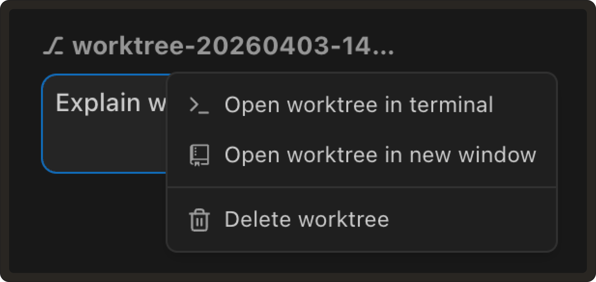
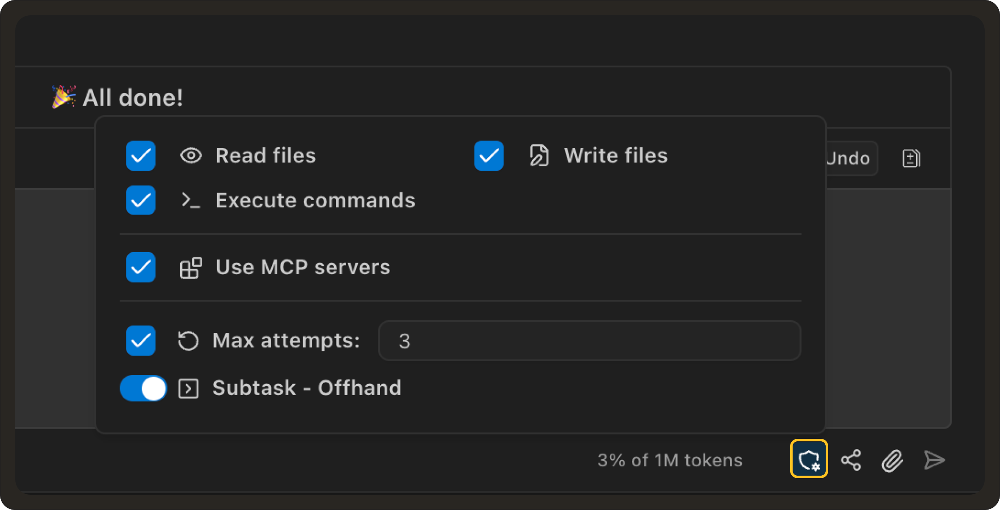

# Weekly Update #27

### TL;DR

This release brings last week’s preview features into full availability, with improved stability and performance.

It also introduces new improvements like reduced prompt size for faster context and a cleaner worktree experience.

More below!

### ✨ Enhancements

- **Multi-step follow-up questions:** We’ve improved how Pochi ask follow-up questions. Instead of being limited to a single question, Pochi is able to ask multiple structured questions in a single interaction, with support for different input types such as single-choice and multi-select.
 
  The updated UI introduces a guided flow with progress (e.g., “1 of 3”), clearer option selection, and a more structured submission experience.
 
  This will make it easier to gather the right context from users before continuing execution. **[#1323](https://github.com/TabbyML/pochi/issues/1323)**
 
  <video
        controls
        style={{
        width: "100%",
        borderRadius: "8px",
        boxShadow: "0 4px 12px rgba(0, 0, 0, 0.15)",
        }}
    >
        <source src="https://assets.docs.getpochi.com/askfollowup-038.mp4" type="video/mp4" />
        Your browser does not support the video tag.
    </video>

- **Reduced prompt size for faster and cleaner context:** Pochi no longer includes a full file listing of the workspace in the initial system context.
 
  Previously, large repositories could add hundreds of files to the prompt, increasing token usage and slowing down responses. The agent now relies on tools like listFiles and globFiles to explore the workspace on demand.
 
  This reduces prompt noise, improves latency, and keeps context more relevant to the task. **[#1398](https://github.com/TabbyML/pochi/issues/1398)**
 

- **Cleaner worktree actions and open in new window:** Worktree actions are now grouped into a dropdown menu to reduce visual clutter in the task panel.

  You can also open a worktree in a new VS Code window directly from the toolbar, making it easier to work on multiple worktrees in parallel. **[#1399](https://github.com/TabbyML/pochi/issues/1399)**
 
  

- **Support for shared `.agents/skills` directory:** Pochi now support loading skills from `.agents/skills` in addition to `.pochi/skills`.

  This aligns with emerging cross-agent conventions, making it possible to define skills once and reuse them across multiple AI coding tools without duplication. **[#1342](https://github.com/TabbyML/pochi/issues/1342)**
 

- **Built-in explore agent:** We’re making the explore agent a built-in part of Pochi.
 
  This introduces a dedicated agent for understanding and navigating codebases, with support for safe, read-only operations and integration with other agents like the planner.
 
  This makes it easier to inspect projects, gather context, and delegate exploration before taking action. **[#1350](https://github.com/TabbyML/pochi/issues/1350)**

- **Improved permission controls in chat:** We’re updating how auto-approve (permission) controls are accessed in the chat UI.
 
  Instead of a separate toolbar row, permissions will be moved into a compact button in the input bar, making them easier to access without taking up additional space.
  
  This results in a cleaner layout while keeping all permission controls quickly accessible when needed.**[#1347](https://github.com/TabbyML/pochi/issues/1347)**
 
 

- **Cleaner task archiving experience:** We’ve improved how task archiving works to make it more consistent and easier to navigate.
 
  Tasks are automatically archived when their worktree is deleted, and all archived tasks are grouped into a single unified view instead of being split across different sections.

  This simplifies the task panel and makes it easier to find past work without switching between multiple filters.**[#1346](https://github.com/TabbyML/pochi/issues/1346)**
 

- **Background subtask execution:** We’ve improved how subtasks run in the background.Subtasks are now able to execute asynchronously in separate tabs without blocking the parent task, while also ensuring file access and state remain consistent.
 
  This makes it easier to run parallel work and manage longer-running subtasks without interrupting your main flow.**[#1354](https://github.com/TabbyML/pochi/issues/1354)**

### 🐛 Bug fixes 

- **Fix subagents getting stuck under high parallel load:** Fixed an issue where subagents could become stuck when many agents were running in parallel and waiting on tool calls.

  This could cause multiple agents to remain in a waiting state without completing their tasks.

  Subagents now make consistent progress under high concurrency, ensuring tasks continue executing even when many agents are active at the same time.**[#1345](https://github.com/TabbyML/pochi/issues/1345)**

- **Fix styling issues in modern VS Code dark themes:** Fixed an issue where parts of the Pochi webview could become hard to see or blend into the background when using newer VS Code dark themes.
 
  UI elements now maintain proper contrast and readability across different theme variants. **[#1351](https://github.com/TabbyML/pochi/issues/1351)**