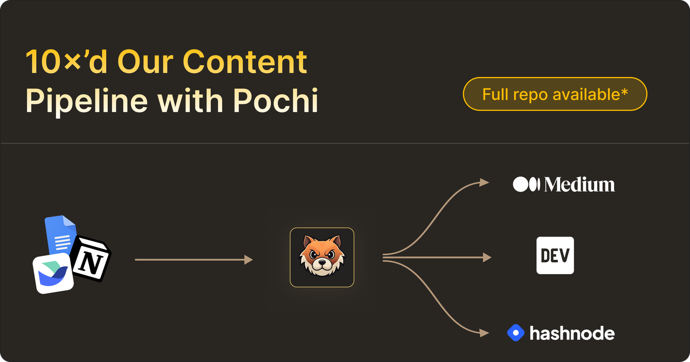
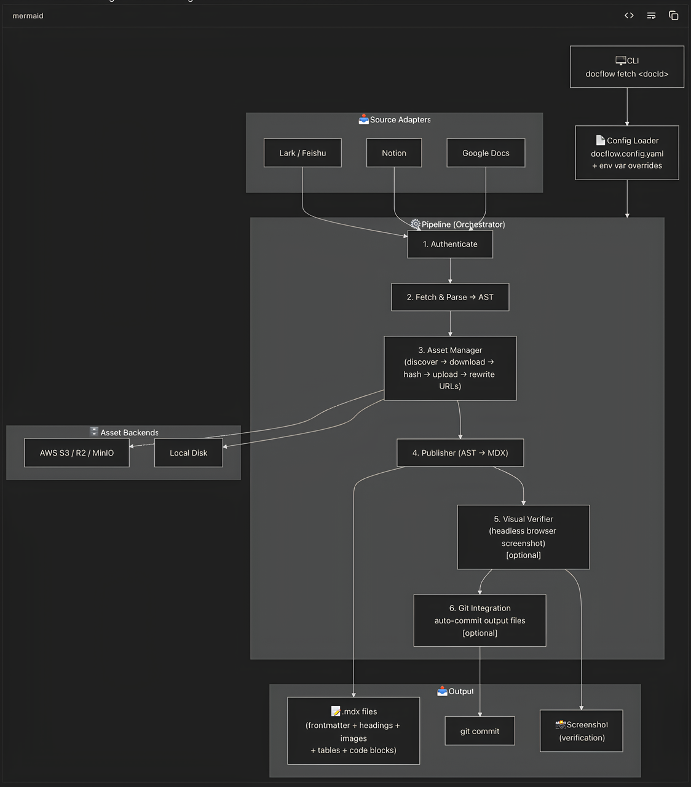
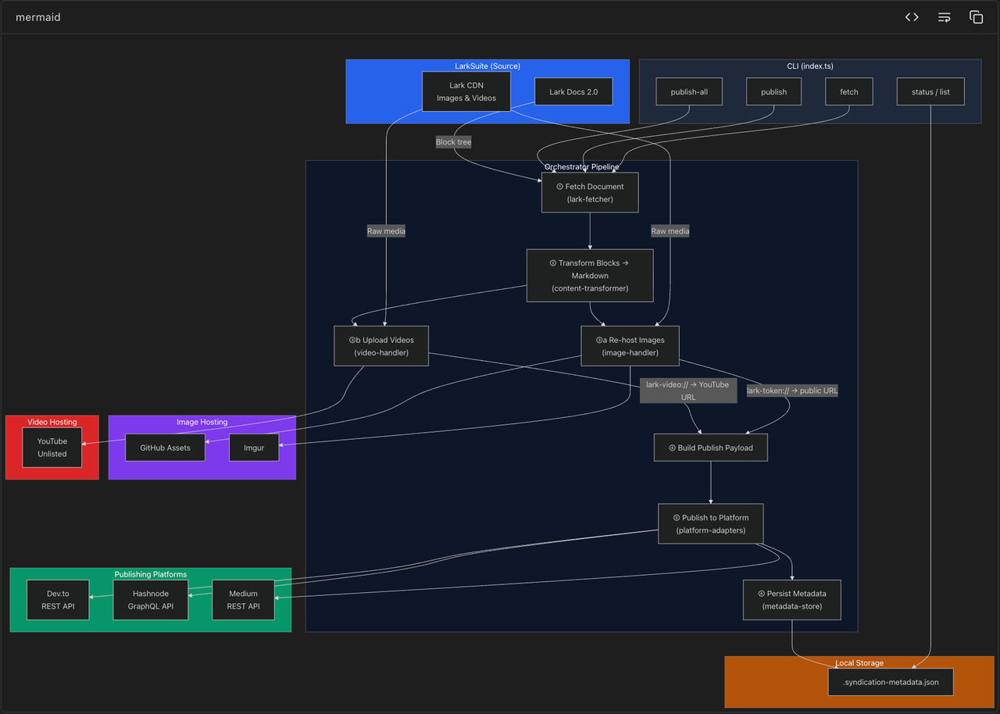

# Title: 10x Content Publishing Flow with Pochi


At Pochi, a big part of the marketing team’s work is publishing developer content such as tutorials, product updates, and technical deep dives. Writing the article is only one part of the workflow. Much of the work that follows is repetitive, involving the same steps each time to prepare content for the documentation site, manage artifacts like images and videos, and share it across developer platforms. 



After going through this publishing process a few times, we realized that most of this work was not complex, but highly repetitive and structured. 

Tasks that previously took over an hour and required multiple manual steps are now handled in seconds with the right automation, allowing us to publish consistently without delays or context switching.

In this post, we’ll walk through how our marketing team approached this as an engineering problem and used Pochi to automate it.

## Manual Processes Now Getting Fully Automated

Most of our  content starts in collaborative docs like Lark, Google Docs, or Notion to allow reviewing and collaboration, but documentation sites and developer platforms expect a very different format.


To reduce this operational overhead, we started experimenting with Pochi to see if we could automate parts of our publishing pipeline. The result was two small internal workflows we built for our own process, which are now part of our day-to-day publishing workflow.

### DocFlow: Automating Docs Publishing 

The first workflow we built with Pochi became [**DocFlow**](https://github.com/mufassirkazi/docflow)**,** a small CLI that automates documentation publishing by converting Lark, Notion, or Google Docs documents into Markdown for our documentation site.



Our documentation content is typically written in Lark for collaboration and feedback, while the site itself is built with Next.js and expects Markdown/MDX files with properly hosted assets. DocFlow fetches the document through Lark API and converts the block-based content into a structured AST. From there, it generates Markdown while preserving elements such as headings, code blocks, images, and videos.

Media blocks are uploaded to S3 and their references are automatically updated in the generated Markdown.


```
docflow fetch <doc-id>
```


  <video
        controls
        style={{
        width: "100%",
        borderRadius: "8px",
        boxShadow: "0 4px 12px rgba(0, 0, 0, 0.15)",
        }}
    >
        <source src="https://assets.docs.getpochi.com/demo-docflow.mp4" type="video/mp4" />
        Your browser does not support the video tag.
    </video>

Instead of manually converting the document, handling media uploads, and fixing asset links, the entire process becomes a single command. What used to take close to 40 minutes for longer posts now takes only 10 seconds - roughly a **300× productivity gain**. For a publishing cadence of two posts a week, this translates to **~5 hours of manual work saved each month, removing a significant amount of repetitive effort from our workflow.**


### Content Syndicator: Automating Blog Distribution 

The second workflow we built with Pochi became [**Content Syndicator**](https://github.com/mufassirkazi/content-syndicator), which focuses on distributing developer articles across multiple platforms.

Developer articles are often shared on platforms such as Dev.to, Hashnode, and Medium. Publishing to each platform manually quickly becomes repetitive since the same content needs to be formatted accordingly, media assets must be handled correctly, and posts need to be created separately on each platform.

Content Syndicator automates this process. It fetches the article from Lark, converts the content into Markdown, and prepares media assets for publishing. Images are re-hosted to GitHub to ensure they are publicly accessible across platforms.

Video blocks require a different workflow. Videos embedded in Lark documents are uploaded to YouTube using the YouTube API, and the generated embed links are inserted into the article. These embeds work across Dev.to and Hashnode, and can also be reused when importing the article into Medium.




```
content-syndicator publish-all --doc-id <id>
```


  <video
        controls
        style={{
        width: "100%",
        borderRadius: "8px",
        boxShadow: "0 4px 12px rgba(0, 0, 0, 0.15)",
        }}
    >
        <source src="https://assets.docs.getpochi.com/demo-content-syndicator.mp4" type="video/mp4" />
        Your browser does not support the video tag.
    </video>

Previously, preparing and publishing a single article across multiple platforms could take over an hour of manual work. With Content Syndicator, the same process now takes less than a minute and can be triggered with a single command. 

Across a typical month of publishing, this reduces roughly **8 hours of manual work to under 10 minutes**, removing a significant amount of repetitive effort from our workflow.


## Process Automation with Pochi

Pochi made it possible to prototype and iterate on these workflows quickly. Instead of manually researching APIs and wiring everything together from scratch, we described the workflow we wanted and refined the implementation interactively.

While building these tools, we used Pochi to explore the Lark API, scaffold the CLI structure, and iterate on the publishing pipelines for different platforms. When something broke, we could debug and adjust the implementation within the same workflow.


What started as small automation scripts eventually evolved into reusable internal tools that now support our developer content publishing process.

These workflows were never meant to be general-purpose tools. They were built specifically for our own publishing pipeline and the way our team works. The interesting part was how quickly Pochi made it possible to build something tailored exactly to our needs.

If you're curious about how these workflows were built, you can view the full Pochi task walkthroughs that show the prompts and iterations used during development:

- [**DocFlow walkthrough**](https://app.getpochi.com/share/p-929ac541810e4bedaac026822ab95ecb)
- [**Content Syndicator walkthrough**](https://app.getpochi.com/share/p-ac8d39afa87e463bac0eb68e6a70ae3c)


## The Bigger Picture

What changed for us was how we approached the problem. Instead of looking for the right tool or filing a ticket, we started treating gaps in our workflow as things we could solve ourselves.

Pochi makes that approach practical by shortening the distance between identifying a problem and building a solution, turning everyday workflow challenges into opportunities to create better, faster, and more tailored solutions.

In our case, it started with content publishing. Today, the same approach can be applied across every part of your work where existing tools fall short of how your team operates.

This is also why the idea of the **GTM engineer** is becoming increasingly popular. People closest to the workflow can build and iterate the tools they need themselves without waiting for dedicated engineering support.

With Pochi, you can reimagine your workflows, unlock new efficiencies, and create the tools your team has always needed starting today.
