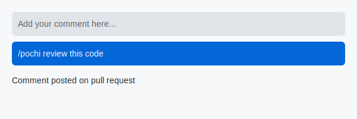
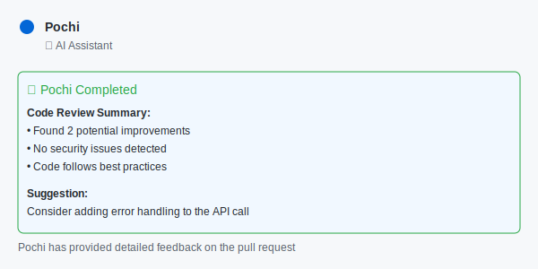

# GitHub Integration

Pochi provides a powerful GitHub Action that brings AI-powered code analysis directly to your pull requests. With just a simple comment, you can get intelligent feedback, code reviews, explanations, and suggestions from Pochi.

## 🚀 Quick Setup

To get started with the Pochi GitHub Action:

1. Install the action with our one-line installer:
   ```bash
   curl -sSL https://raw.githubusercontent.com/tabbyml/pochi/main/packages/github-action/scripts/install | bash
   ```

2. Add your Pochi token to GitHub Secrets as `POCHI_TOKEN`

3. Start using Pochi by commenting on PRs with `/pochi` followed by your request

## 📋 Prerequisites

Before using the Pochi GitHub Action, you need:

1. **A Pochi account**: Visit [getpochi.com](https://getpochi.com) to create an account
2. **A Pochi session token**: Obtain this from your Pochi dashboard
3. **Write permissions** to the repository where you want to install the action

## ⚙️ Installation

### Method 1: One-Line Installer (Recommended)

Run this command in your repository root directory:

```bash
curl -sSL https://raw.githubusercontent.com/tabbyml/pochi/main/packages/github-action/scripts/install | bash
```

This will automatically:
- Detect your repository information
- Create the necessary workflow file
- Provide setup instructions

### Method 2: Manual Installation

1. Create a workflow file at `.github/workflows/pochi.yml`:
   ```yaml
   name: pochi AI Assistant

   on:
     issue_comment:
       types: [created]

   permissions:
     contents: read
     issues: write
     pull-requests: write

   jobs:
     pochi:
       if: github.event.issue.pull_request
       runs-on: ubuntu-latest
       steps:
         - uses: actions/checkout@v4

         - name: Run pochi
           uses: tabbyml/pochi/packages/github-action@action@latest
           with:
             pochi_token: ${{ secrets.POCHI_TOKEN }}
   ```

2. Add your Pochi token to GitHub Secrets:
   - Go to repository **Settings** → **Secrets and variables** → **Actions**
   - Click **New repository secret**
   - Name it `POCHI_TOKEN` and paste your token

## 💬 Usage

Once installed, you can interact with Pochi by commenting on any pull request:

### Basic Commands

- `/pochi review` - Get a code review of the changes
- `/pochi explain` - Get an explanation of what the code does
- `/pochi suggest` - Get suggestions for improvements
- `/pochi check` - Check for security issues and best practices
- `/pochi help` - Show available commands

### Examples

```
/pochi review this pull request and check for potential bugs
```

```
/pochi explain how the new authentication system works
```

```
/pochi suggest improvements to the performance of this algorithm
```

## ⚙️ Configuration

### Action Inputs

| Input         | Description               | Required | Default |
|---------------|---------------------------|----------|---------|
| `pochi_token` | Your Pochi session token  | Yes      | -       |
| `model`       | AI model to use for tasks | No       | Default model |

### Environment Variables

The action also respects these environment variables:

| Variable        | Description              | Default |
|-----------------|--------------------------|---------|
| `POCHI_TOKEN`   | Pochi session token      | -       |
| `POCHI_MODEL`   | Override default model   | -       |

### Advanced Workflow Configuration

For more control over when the action runs:

```yaml
name: pochi AI Code Review

on:
  issue_comment:
    types: [created]

permissions:
  contents: read
  issues: write
  pull-requests: write

jobs:
  pochi-review:
    # Only run when comment contains '/pochi'
    if: |
      github.event.issue.pull_request && 
      contains(github.event.comment.body, '/pochi')
    runs-on: ubuntu-latest
    steps:
      - name: Checkout PR
        uses: actions/checkout@v4
        with:
          token: ${{ secrets.GITHUB_TOKEN }}

      - name: pochi AI Assistant
        uses: tabbyml/pochi/packages/github-action@action@latest
        with:
          pochi_token: ${{ secrets.POCHI_TOKEN }}
          model: gpt-4 # Specify a custom model
```

## 🎯 Features

- 🤖 **AI-powered code analysis** using advanced language models
- 💬 **PR comment integration** - responds naturally to comment requests
- 🔍 **Context-aware** - understands full PR context including files, changes, and previous comments
- 🚀 **Easy setup** - minimal configuration required
- 🔒 **Secure** - uses GitHub's built-in token system
- 🔄 **Real-time updates** - shows progress during execution
- 📊 **Detailed output** - provides comprehensive analysis results

## 📸 Workflow Example

Here's what using Pochi looks like in practice:

1. **Comment on a PR with a request**:
   

2. **Pochi starts working and shows progress**:
   

3. **Receive detailed feedback on your code**:
   

## � troubleshoot Troubleshooting

### Action doesn't respond

1. Check that the PR comment contains `/pochi`
2. Verify `POCHI_TOKEN` is set in repository secrets
3. Ensure workflow has correct permissions
4. Check workflow runs in Actions tab

### Permission errors

Make sure your workflow includes:

```yaml
permissions:
  contents: read
  issues: write
  pull-requests: write
```

### Token issues

1. Ensure your `POCHI_TOKEN` is valid and not expired
2. Check that the token has been correctly added to GitHub Secrets
3. Verify the token has necessary permissions for your repository

## 🛡️ Security

The Pochi GitHub Action follows security best practices:

- Tokens are stored securely in GitHub Secrets
- The action runs in an isolated environment
- No code is stored or transmitted outside of the GitHub Actions environment
- All communication is encrypted

For additional security, you can:
- Use a custom GitHub token with minimal required permissions
- Regularly rotate your Pochi session token
- Review the action source code before use

## 📄 License

The Pochi GitHub Action is distributed under the MIT License. See the [LICENSE](https://github.com/tabbyml/pochi/blob/main/packages/github-action/LICENSE) file for more information.