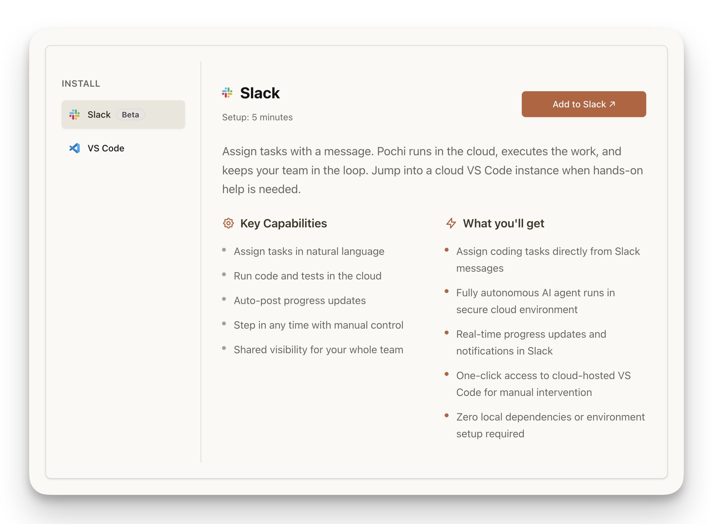
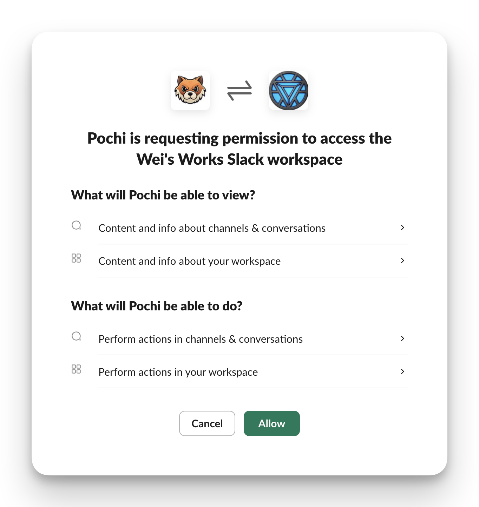
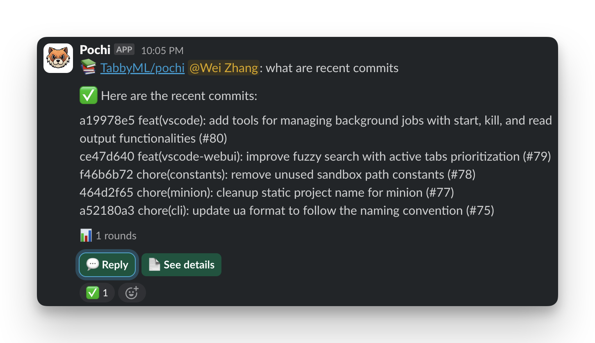
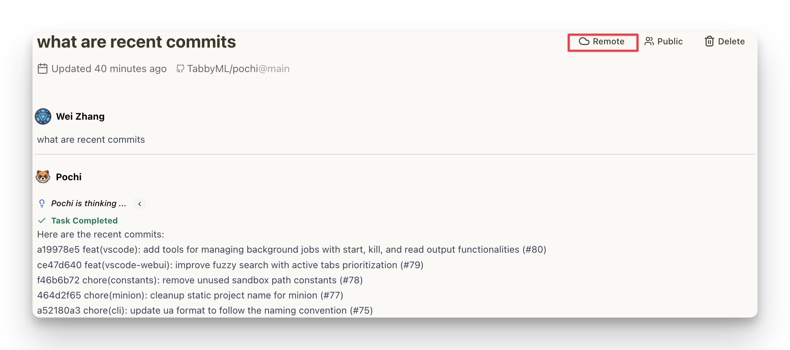
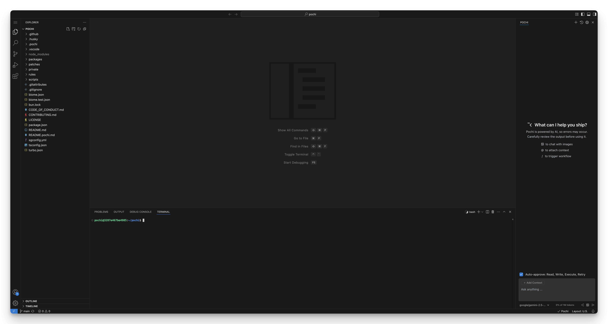

# Slack Integration

**Slack Integration** allows you to use Pochi directly within your Slack workspace, bringing AI-powered development assistance to your team conversations. Start tasks in Slack and seamlessly hand them over to VSCode when you need the full IDE experience.

<Callout type="info" title="Cloud Execution">
  When you send messages to Pochi in Slack, tasks are executed in the cloud, so you can collaborate without needing local development environments.
</Callout>

## Features

- **Native Experience**: View the entire conversation thread directly in Slack
- **Team Visibility**: Share development progress with your team in real-time
- **Context Preservation**: All conversation history is maintained within the Slack thread and Pochi Tasks
- **Isolated Workspace**: Each Slack Task becomes a separate workspace, isolated from other tasks
- **Cloud Execution**: Tasks are executed in the cloud, so you can collaborate without needing local development environments

## Getting Started

### Adding Pochi to Your Workspace

1. **Install the Integration**: Add Pochi to your Slack workspace through the `Add to Slack` button on the [homepage](https://app.getpochi.com/home)
   
2. **Authorize Access**: Grant necessary permissions for Pochi to interact with your Slack channels
   
3. **Start Collaborating**: Begin using Pochi in any channel or direct message where it's been added. If using channels, please make sure to invite Pochi to the channel before creating a task

### Basic Usage

Once Pochi is added to your workspace:

1. [Optional] **Invite Pochi to Channels**: If you want to interact with Pochi in channels, simply send `@Pochi` in the channel, and you will be prompted to invite Pochi to the channel
2. [Optional] **Default Repo**: Set the target repository in the Channel Topic, so Pochi knows which repository to work on by default
   1. Format: `[repo:OWNER/REPO]`, for example, `[repo:TabbyML/pochi]`
3. **Start Task**: Send a task prompt to Pochi in Direct Messages or channels using the following format:
   1. If a default repo is set: `/newtask PROMPT`, for example, `/newtask What are recent commits`
   2. If no default repo is set or you want to run with another repo: `/newtask [OWNER/REPO] PROMPT`, for example, `/newtask [TabbyML/tabby] What are recent commits`
4. **Real-time Updates**: Watch as Pochi executes tasks and provides updates directly in Slack
5. **Follow-up**: After the task is completed, Pochi will prompt some follow-up options, or you can provide your own follow-up question by clicking the option buttons or Reply button

### Seamless Handover to VSCode

When you need the full IDE experience:

1. **Access Task Page**: Click on the `See Details` button to navigate to the task in Pochi's web interface
2. **Click Remote Icon**: Look for the remote/external link icon in the task interface
   
3. **VSCode Web with Pochi Extension**: Get instant access to a VSCode web environment with a pre-configured Pochi extension
4. **Continue Development**: Pick up exactly where you left off with full IDE capabilities
   

## Troubleshooting

### Common Issues

**`not_in_channel` error when creating task in channel**
- Verify that Pochi has been properly added to the channel
- Mention @Pochi in the channel if Pochi is not invited to the channel

**Cannot access VSCode Web**
- Only the Task Owner has permission to access VSCode Web
- Make sure you are the Task Owner and logged in to Pochi with the same account in your browser

---

**Need help?** Visit our [Community Support](/community-support) page or join our [Discord](https://getpochi.com/discord) for assistance with Slack integration.
