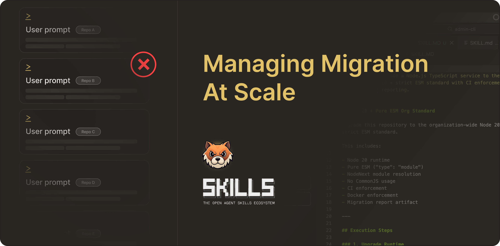

# Manage Library Migration At Team Scale

Library  migration is a common but tedious part of maintaining production systems in an engineering team. It often involves coordinating changes across source code, dependencies, configuration, Docker images, and CI pipelines. When these changes need to be repeated across multiple repositories, keeping everything consistent quickly becomes difficult.




Structured migration prompts in Pochi can automate much of this work by applying coordinated changes across a repository in a single execution. However, a successful migration is only part of the solution. If the upgrade logic remains inside a prompt, it is not reusable, version-controlled, or enforceable across repositories.

In this article, we demonstrate how we evolve the migration solution into a reusable Skill,  and eventually enforce it with CI and lint checks to become an executable engineering standard.


Let's take the  runtime upgrade from Node 18 to Node 20 as a working example.


## Project Setup

We have two small sample repositories (`backend-service` and `admin-cli`) running Node 18 + CommonJS with Docker and GitHub Actions pinned to Node 18.


The goal was to migrate them to Node 20 + strict ESM.


For some variation, the structure of `backend-service` repository looked like this:

```
backend-service/
├── src/
│   ├── server.ts
│   ├── utils/logger.ts
│   └── __tests__/server.test.ts
├── Dockerfile
├── package.json
├── tsconfig.json
└── .github/workflows/ci.yml
```

Here’s an example of the current CommonJS usage we had in it:

```javascript
// src/server.ts
const { log } = require("./utils/logger");

function startServer() {
  log("Server started");
  return true;
}

module.exports = { startServer };
```

It built and passed tests successfully:

<video
        controls
        style={{
        width: "100%",
        borderRadius: "8px",
        boxShadow: "0 4px 12px rgba(0, 0, 0, 0.15)",
        }}
    >
        <source src="https://assets.docs.getpochi.com/migration-skills-part-1.mp4" type="video/mp4" />
        Your browser does not support the video tag.
    </video>

The `admin-cli` repo was intentionally a bit different. It used a CLI entry point and had a slightly modified tsconfig and Jest files. It even had a small Scripts folder. 

```
admin-cli/
├── src/
│   ├── cli.ts
│   ├── commands/
│   │   ├── sync.ts
│   │   └── deploy.ts
│   ├── utils/logger.ts
│   └── tests/
├── Dockerfile
├── package.json
├── tsconfig.json
└── .github/workflows/ci.yml
```

##  One-Shot Migration Prompt

We started with the most straightforward approach. Inside `backend-service`, we ran a Pochi task with the following prompt:

```bash
Prompt:
Migrate this project from Node 18 + CommonJS to Node 20 + strict ESM.
- Add "type": "module"
- Use NodeNext module resolution
- Convert require → import
- Convert module.exports → export
- Add .js extensions
- Update Docker to node:20
- Update GitHub Actions to Node 20
- Ensure build and tests pass
```

We did this using a strong model (`claude-4-5-opus`), and the migration completed successfully.

<video
        controls
        style={{
        width: "100%",
        borderRadius: "8px",
        boxShadow: "0 4px 12px rgba(0, 0, 0, 0.15)",
        }}
    >
        <source src="https://assets.docs.getpochi.com/migration-with-claude.mp4" type="video/mp4" />
        Your browser does not support the video tag.
    </video>

The build passed, tests succeeded, and a quick grep confirmed no `require()` or `node:18 `references remained.

<video
        controls
        style={{
        width: "100%",
        borderRadius: "8px",
        boxShadow: "0 4px 12px rgba(0, 0, 0, 0.15)",
        }}
    >
        <source src="https://assets.docs.getpochi.com/migration-blog-builds-and-tests.mp4" type="video/mp4" />
        Your browser does not support the video tag.
    </video>

The one-shot migration worked. But the upgrade logic lived entirely inside that prompt.

Reusing it across repositories or evolving it later (Node 22, new testing rules, etc.), would mean rewriting and re-running prompts manually. Instead of keeping standards in chat history, we encoded them as a reusable Skill.

## Migration Skill

We moved the migration spec into a reusable Skill stored in a central repository. A Skill in Pochi is a version-controlled set of instructions that agents can execute when performing a task.

By encoding the migration as a Skill instead of keeping it in a prompt, the upgrade logic becomes reusable across repositories, shared across the team, and actively maintained in one place as the standard evolves.

To store this shared standard, we created a small repository that contains the Skill definition:

```bash
mkdir org-engineering-standards
cd org-engineering-standards
git init
```


Inside the repository, we created the following structure:

```
org-engineering-standards/
└── skills/
    └── node20-esm-org-standard/
        └── SKILL.md
```

Inside `skills/node20-esm-org-standard/SKILL.md`, we defined the full specification for our Node 20 + strict ESM standard.

```yaml
---
name: node20-esm-org-standard
description: Upgrade a Node.js TypeScript service to the org-wide Node 20 + strict ESM standard with CI enforcement and migration reporting.
---

# Node 20 + Pure ESM Org Standard

Upgrade this repository to the organization-wide Node 20 + strict ESM standard.

This includes:

- Node 20 runtime
- Pure ESM ("type": "module")
- NodeNext module resolution
- No CommonJS usage
- CI enforcement
- Docker enforcement
- Migration report artifact

---

## Execution Steps

### 1. Upgrade Runtime

- Update Dockerfile base image to `node:20`
- Update GitHub Actions workflow to use Node 20
- Add to package.json:


"engines": {
  "node": ">=20"
}


---

### 2. Enforce Pure ESM

- Add `"type": "module"` to package.json
- Convert all `require()` to `import`
- Convert all `module.exports` to `export`
- Add explicit `.js` extensions to relative imports
- Update tsconfig.json:


{
  "module": "NodeNext",
  "moduleResolution": "NodeNext"
}


---

### 3. Add Drift Detection Script

Add to package.json scripts:

"check:esm": "grep -R \"require(\" src && echo '❌ CommonJS detected' && exit 1 || echo '✅ ESM clean'"


---

### 4. Enforce in CI

In GitHub Actions workflow, add step:

- run: npm run check:esm

This must fail CI if CommonJS is detected.

---

### 5. Add Migration Report Generator

Create:

`scripts/generate-migration-report.js`

With contents:

import fs from "fs";

const report = {
  nodeVersion: process.version,
  esm: true,
  timestamp: new Date().toISOString()
};

fs.writeFileSync("migration-report.json", JSON.stringify(report, null, 2));
console.log("Migration report generated.");


Add to package.json scripts:

"generate:report": "node scripts/generate-migration-report.js"


---

### 6. Validation Checklist

After applying this skill:

- No `require(` remains in src
- No `module.exports` remains
- Docker uses node:20
- CI uses Node 20
- tsconfig uses NodeNext
- Build succeeds
- Tests pass
```


Now that the Skill was defined, we applied it to one of our existing repositories. First, we switched back to `admin-cli`:


```bash
cd ../admin-cli
```


Then we added the Skill from the central standards repository:


```bash
npx skills add ../org-engineering-standards --skill node20-esm-org-standard --agent pochi
```

This installed the Skill into:


```bash
admin-cli/.pochi/skills/node20-esm-org-standard/
```

<video
        controls
        style={{
        width: "100%",
        borderRadius: "8px",
        boxShadow: "0 4px 12px rgba(0, 0, 0, 0.15)",
        }}
    >
        <source src="https://assets.docs.getpochi.com/migration-as-standard.mp4" type="video/mp4" />
        Your browser does not support the video tag.
    </video>

By default, this got added as a symlink. That means if we update the Skill in `org-engineering-standards`, those updates are automatically reflected in every repository using it.

The standard now lives in one place. 


Once the Skill is installed, repositories can share the same migration logic without copying prompts between projects. Any repository that adopts the Skill inherits the standard defined in the central repository.


## Enforcing the Standard with ESLint

The Skill defines how the migration should happen, but it doesn’t prevent someone from accidentally reintroducing CommonJS later. To deploy this in a team setting, we'd prefer having it more natively embedded in our CI as part of our code standard, so it can be autonomously running to enforce using the latest library for all future code changes. 

To do so, we added ESLint rules that reject `require()` and `module.exports`. The repository now runs `npm run lint` in CI on every push and pull request.

If CommonJS appears again, the lint step fails and the pipeline stops. This turns the standard into something that is automatically enforced rather than something developers have to remember.

<video
        controls
        style={{
        width: "100%",
        borderRadius: "8px",
        boxShadow: "0 4px 12px rgba(0, 0, 0, 0.15)",
        }}
    >
        <source src="https://assets.docs.getpochi.com/lint-check-with-details.mp4" type="video/mp4" />
        Your browser does not support the video tag.
    </video>

## Conclusion

At this point the migration, the standard, and its enforcement all live inside the repository itself.  The migration itself wasn’t the interesting part. The interesting part was moving from a one-off prompt that upgrades a repo to a reusable, version-controlled, executable standard.

Node 20 was just the example. The real experiment was looking at how we can treat engineering standards as code and how Pochi’s Skills system helps us achieve that.


