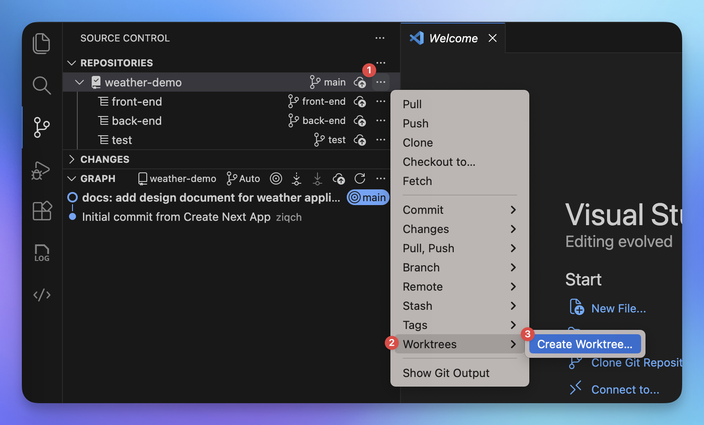
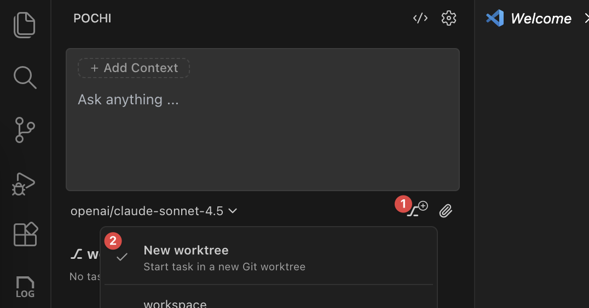

# Parallel Agent Development From Scratch

This tutorial demonstrates best practices for using Pochi's Parallel Agents feature to accelerate development by working on multiple tasks concurrently. You'll learn the complete workflow from project setup to integration, using a practical example project.

## What You Will Learn

This tutorial focuses on mastering parallel agent workflows:

- How to create and manage parallel agent tasks in Pochi
- How to structure projects for effective parallel development
- How to coordinate multiple agents using design documents
- How to work with Git worktrees for isolated development
- How to merge and integrate work from parallel tasks

We'll guide you through building a complete project from scratch, demonstrating these concepts in practice.

## Prerequisites

- Pochi installed and running in your editor
- Node.js (version 18+) and npm installed
- Git installed and configured on your system

## How It Works

Pochi's Parallel Agents run multiple AI agents concurrently, each in its own Git worktree with an isolated branch. Agents work independently on different tasks while sharing the same repository context, allowing you to develop frontend, backend, and tests simultaneously without conflicts.

Learn more in the [Parallel Agents documentation](../parallel-agents.mdx).

## Step 1: Set Up the Environment and Initialize the Project

First, we'll create a new project directory and initialize it as a Git repository. This repository will serve as the foundation for our parallel development workflow.

### Create the Project Directory

```bash
npx create-next-app@latest weather-demo
cd weather-demo
```

## Step 2: Write a Design Document

A well-structured design document is crucial when working with parallel agents. It serves as the single source of truth that all agents will reference to understand the project requirements, architecture, and their specific responsibilities.

### Create the Design Document

Create a file `docs/design.md` with the following content:

````markdown
# Weather Application Design Document

## Project Overview

You are building a **Weather Demo** tool that provides:

- **Current weather**
- **Hourly forecast** for today
- **7-day forecast**

**Tech Stack:**

- Backend: Next.js API
- Frontend: Next.js (React)
- Testing: Jest / Vitest

## Data Structure

```ts
interface WeatherResponse {
  location: string;       
  current: Weather;       
  hourly: Weather[];      
  daily: Weather[];       
}

interface Weather {
  time: string;           
  temperature: number;    
  temperature_min: number;
  temperature_max: number;
  condition: string;      
  uv_index: number;       
}
```

## Agent Tasks

### Agent A - Backend API

- **Endpoint:** `GET /api/weather`

- **Query Parameters:**
  - `location?: string`  
    Example: `/api/weather?location=Seattle`

- **Responsibilities:**
  - Generate **random weather data** according to the `Weather` interface.
  - Returned data must contain:
    - `current`: current random weather
    - `hourly`: **24** randomly generated weather entries (one per hour for today)
    - `daily`: **7** randomly generated weather entries starting from today forward
  - If `location` is not provided, default to a placeholder (e.g., `"Unknown"` or `"San Francisco"`).

- **Random Data Requirements:**
  - `temperature`: reasonable range (e.g., -10°C ~ 40°C)
  - `temperature_min` / `temperature_max` must be consistent
  - `condition`: pick randomly from a preset list (e.g., `"Sunny"`, `"Cloudy"`, `"Rain"`, `"Snow"`)
  - `uv_index`: 0–11
  - `time`:
    - `current`: current timestamp
    - `hourly`: each entry = current day, hour increasing
    - `daily`: each entry = day increasing

---

### Agent B - Frontend Rendering

- **Route Requirement:**
  - The page should be accessed using:
    ```
    /weather?location=CityName
    ```
  - The frontend should **read `location` from the query string** and pass it to `/api/weather`.

- **Responsibilities:**
  - Build a **Next.js page** that fetches weather data from `/api/weather?location=CityName`.
  - Render the following sections:

- **UI / UX Requirements**
    - Layout should be **clean, modern, and visually appealing**
    - The page has three sections:
        - Current Weather  
            - Show: city, current temp, min/max temp, condition, UV index
        - Hourly Forecast  
            - Horizontal list
            - Each item: time, condition, temperature
        - 7-Day Forecast  
            - Vertical list
            - Each item: date, condition, temperature range
            - Show the range with a bar

    - Suggested styling goals:
        - Clear section titles
        - Cards or panels to group information
        - Consistent spacing & alignment
        - Responsive layout (desktop & mobile look good)
        - You may use Tailwind

### Agent C - Testing

- **Responsibilities:**
  - Validate **backend API response**:
    - Structure matches `WeatherResponse`
    - All required fields are present
    - Types are correct
  - Test **random generation logic**:
    - Hourly count === 24
    - Daily count === 7
  - Test **frontend rendering** using mocked data:
    - Current weather section renders correctly
    - Hourly list renders 24 rows
    - Daily list renders 7 items
    - Location name is displayed
````

### Commit the Design Document

```bash
git add docs/design.md
git commit -m "docs: add design document for weather application"
```

This design document provides clear specifications that each parallel agent can reference when working on their respective tasks.

## Step 3: Create Git Worktrees for Parallel Tasks

Now we'll create three separate worktrees, each with its own branch, for the three parallel development tasks: frontend, backend, and testing.

### Method 1: Using VSCode Source Control

You can create worktrees directly from VSCode's built-in Source Control panel:

1. Open the **Source Control** panel on the left sidebar of VSCode
2. Click on the **three dots menu** (···) in the Source Control header
3. Select **Branch** → **Create Branch From...**
4. Choose the base branch (usually `main`)
5. Enter branch name: `feature/backend`
6. When prompted, select **Create as Worktree**
7. Choose the location: `../weather-demo-backend`
8. Repeat steps 3-7 for the other two branches:
   - Branch: `feature/frontend`, Path: `../weather-demo-frontend`
   - Branch: `feature/tests`, Path: `../weather-demo-tests`

{/* TODO: Add screenshot here showing VSCode Source Control worktree creation */}


### Method 2: Using Pochi Sidebar

Alternatively, you can create worktrees from the Pochi sidebar in New Workspace mode:

1. Open the **Pochi sidebar** in your editor
2. Switch to **New Workspace** mode at the top
3. Navigate to the **Worktrees** section
4. Click **"Create New Worktree"** or the **+** icon
5. Fill in the worktree details:
   - **Branch name**: `feature/backend`
   - **Base branch**: `main`
   - **Path**: `../weather-demo-backend`
6. Click **Create**
7. Repeat steps 4-6 for the other two worktrees:
   - Branch: `feature/frontend`, Path: `../weather-demo-frontend`
   - Branch: `feature/tests`, Path: `../weather-demo-tests`

{/* TODO: Add screenshot here showing Pochi sidebar worktree creation */}


### Method 3: Using Command Line (Alternative)

If you prefer the command line, you can create worktrees using Git commands:

```bash
# Create backend worktree
git worktree add -b feature/backend ../weather-demo-backend

# Create frontend worktree
git worktree add -b feature/frontend ../weather-demo-frontend

# Create tests worktree
git worktree add -b feature/tests ../weather-demo-tests
```

### Verify Worktrees

Check that all worktrees are created successfully:

```bash
git worktree list
```

You should see output listing your main directory and the three new worktrees with their respective branches.

## Step 4: Create Parallel Agent Tasks

Now comes the powerful part - creating parallel agent tasks in Pochi. Each agent will work independently in its own worktree, reading the design document and implementing its assigned component.

### Create Backend Agent Task

1. In Pochi sidebar, navigate to the backend worktree (`../weather-demo-backend`)
2. Click "Create New Task"
3. Enter the prompt:

```
Read the design document at docs/design.md and implement the backend API for the weather application.

Requirements:
- Set up Express server with CORS
- Create GET /api/weather endpoint
- Integrate with OpenWeatherMap API
- Implement input validation and error handling
- Add response caching
- Create .env.example file
- Update package.json with required dependencies

Follow the specifications in the design document exactly.
```

### Create Frontend Agent Task

1. Navigate to the frontend worktree (`../weather-demo-frontend`)
2. Click "Create New Task"
3. Enter the prompt:

```
Read the design document at docs/design.md and implement the React frontend for the weather application.

Requirements:
- Create WeatherSearch component with input and button
- Create WeatherDisplay component to show weather data
- Create ErrorMessage component for error handling
- Implement state management with React hooks
- Add responsive CSS styling
- Implement debounced search
- Add loading states and spinners
- Update package.json with required dependencies

Follow the specifications in the design document exactly. The backend API will be available at http://localhost:3001/api/weather
```

### Create Test Agent Task

1. Navigate to the tests worktree (`../weather-demo-tests`)
2. Click "Create New Task"
3. Enter the prompt:

```
Read the design document at docs/design.md and implement comprehensive tests for the weather application.

Requirements:
- Write backend API tests (endpoint validation, error handling)
- Write frontend component tests (rendering, interactions)
- Write integration tests (full user flow)
- Use Jest and React Testing Library
- Mock external API calls
- Aim for >80% code coverage
- Create test setup and configuration files
- Update package.json with testing dependencies

Follow the specifications in the design document exactly.
```

### Monitor Agent Progress

Once all three tasks are created and running:

1. View all active tasks in the Pochi sidebar
2. Click on any task to see its progress and output
3. Each agent will work independently, reading the design document and implementing its component
4. You can interact with any agent by sending follow-up messages or clarifications

The agents will work in parallel, and you can watch their progress in real-time from the Pochi interface.

## Step 5: Merge Worktrees and Run Tests

Once all agents have completed their tasks, it's time to integrate all the work and verify that everything works together.

### Review Each Worktree

Before merging, review the work in each worktree:

1. Click on each task in Pochi sidebar
2. Select "Diff worktree with origin/main" to see all changes
3. Review the code quality and completeness
4. Test individual components if needed

### Merge Backend Changes

```bash
# Switch to main branch
git checkout main

# Merge backend branch
git merge feature/backend

# Verify no conflicts
git status
```

### Merge Frontend Changes

```bash
# Merge frontend branch
git merge feature/frontend

# Resolve any conflicts if they arise
git status
```

### Merge Test Changes

```bash
# Merge test branch
git merge feature/tests

# Final status check
git status
```

### Install Dependencies

```bash
# Install backend dependencies
cd src/backend
npm install

# Install frontend dependencies
cd ../frontend
npm install

# Install test dependencies (if separate)
cd ../../tests
npm install
```

### Set Up Environment Variables

Create a `.env` file in the backend directory with your OpenWeatherMap API key:

```bash
# In src/backend directory
cp .env.example .env
# Edit .env and add your API key
```

### Run the Application

```bash
# Terminal 1: Start backend
cd src/backend
npm start

# Terminal 2: Start frontend
cd src/frontend
npm start
```

### Run Tests

```bash
# Run all tests
npm test

# Run with coverage
npm test -- --coverage
```

### Verify Integration

1. Open the application in your browser (typically `http://localhost:3000`)
2. Enter a city name in the search field
3. Verify that weather data is fetched and displayed correctly
4. Test error handling by entering an invalid city name
5. Check responsive design by resizing the browser window

If everything works as expected, you've successfully built a complete application using parallel agents.

## Tips and Troubleshooting

### Agent Coordination

- **Consistent Design Document**: Ensure your design document is detailed and clear. All agents reference this document, so ambiguity can lead to inconsistent implementations.
- **API Contracts**: Clearly define API contracts (endpoints, request/response formats) in the design document so frontend and backend agents align perfectly.
- **Version Control**: Commit the design document before creating worktrees so all agents have access to the latest specifications.

### Managing Conflicts

- **Minimize Overlap**: Structure your tasks to minimize file overlap between agents. Frontend, backend, and tests naturally have minimal overlap.
- **Resolve Early**: If conflicts arise during merge, resolve them immediately while the context is fresh.
- **Sequential Merge**: Merge worktrees in a logical order (backend → frontend → tests) to reduce conflict complexity.

### Agent Communication

- **Shared Context**: Use the design document and README as shared context that all agents can reference.
- **Follow-up Questions**: If an agent needs clarification, provide it quickly to avoid blocking.
- **Review Regularly**: Check agent progress periodically to catch issues early.

### Common Issues

**Issue**: Agent can't access design document
- **Solution**: Ensure the design document is committed to the main branch before creating worktrees.

**Issue**: API integration fails between frontend and backend
- **Solution**: Verify API endpoint URLs and response formats match the design document specifications.

**Issue**: Tests fail after merging
- **Solution**: Run tests in each worktree before merging to catch issues early. Update test configurations if paths changed during merge.

**Issue**: Worktree conflicts during merge
- **Solution**: Review the design document for any ambiguous specifications. Update and have agents revise their implementations if needed.

### Performance Tips

- **Parallel Execution**: Start all three agent tasks simultaneously to maximize time savings.
- **Agent Resources**: If agents seem slow, consider using a more powerful model (like opus) for complex tasks.
- **Incremental Review**: Review agent work incrementally rather than waiting until all agents finish.

## Conclusion

Congratulations! You've successfully used Pochi's Parallel Agents to build a complete weather application with frontend, backend, and tests developed concurrently. This tutorial demonstrated how parallel agents can dramatically accelerate development by allowing multiple components to be built simultaneously.

### Key Takeaways

- **Parallel Development**: Multiple agents working in isolated worktrees enable true parallel development without conflicts.
- **Design Documents**: A clear, comprehensive design document is essential for coordinating multiple agents.
- **Git Worktrees**: Leveraging Git worktrees provides isolation while maintaining connection to the same repository.
- **Integration**: Proper merge strategy and testing ensure that parallel work integrates smoothly.

### Next Steps

Now that you understand the basics of parallel agents, consider these advanced applications:

- **Microservices Architecture**: Use parallel agents to develop multiple microservices simultaneously
- **Feature Development**: Split large features into parallel sub-tasks (UI, business logic, API integration, tests)
- **Refactoring Projects**: Refactor different modules in parallel while maintaining consistency
- **Multi-Platform Development**: Build web, mobile, and API versions of an application in parallel

The Parallel Agents feature is a powerful tool for accelerating development. Experiment with different task structures and see how it can fit into your workflow.

For more advanced features and use cases, refer to the [Parallel Agents documentation](../parallel-agents.mdx).
