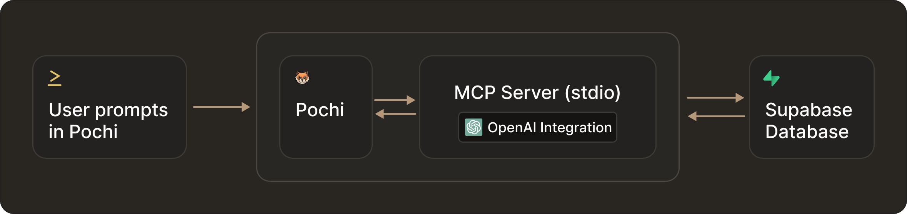
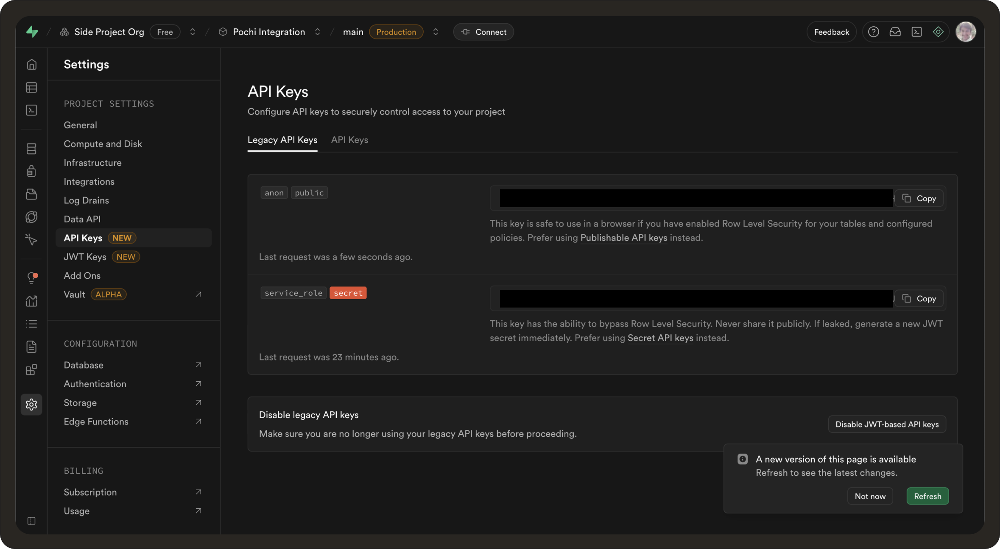
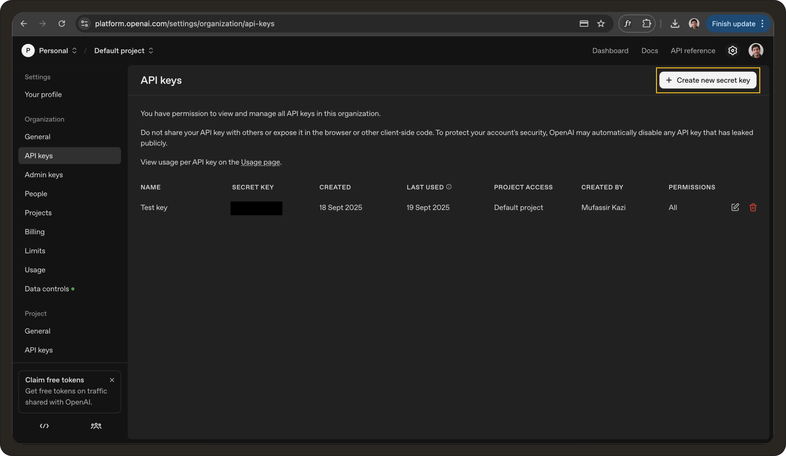
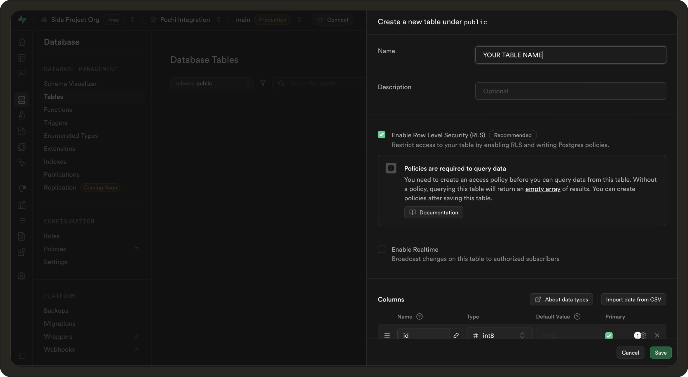
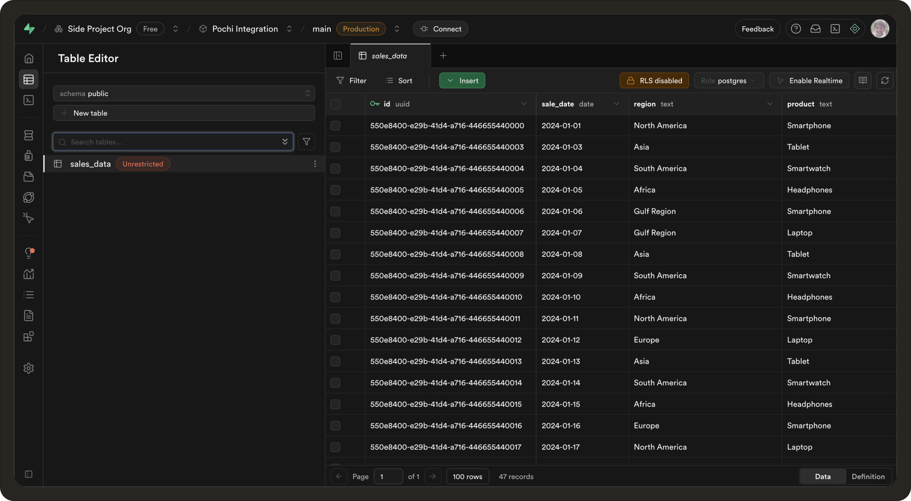
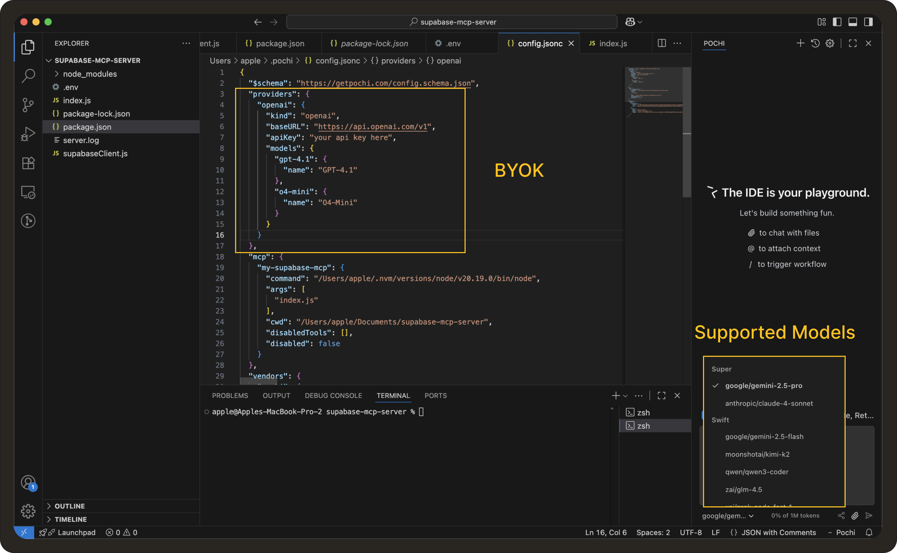
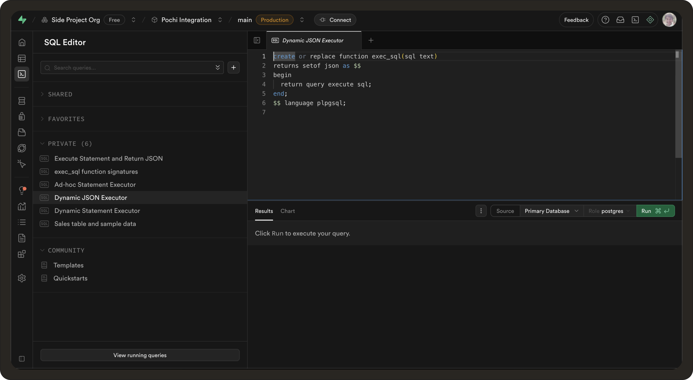
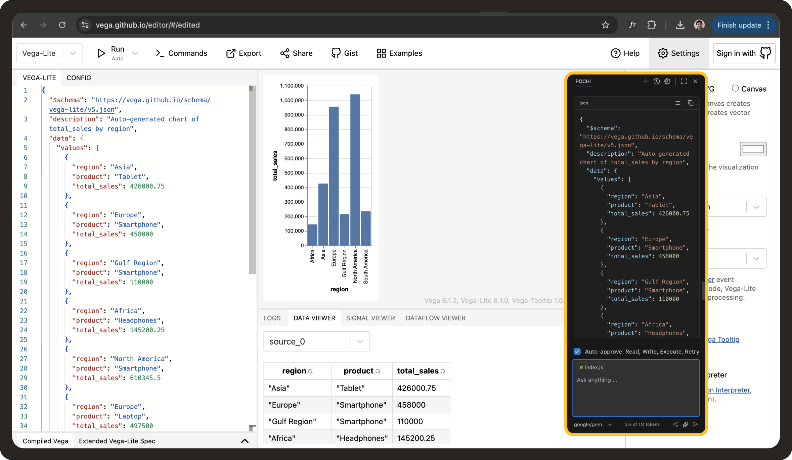

# Building a Supabase MCP Server for Natural Language SQL Queries in Pochi

Often, when working with teams to debug code or build features, you need to look up data from your database. This may include checking if a recent migration seeded correctly, inspecting a particular table schema, or verifying specific column values. Normally, this means breaking your flow, opening the SQL client, writing queries by hand, or involving a co-worker.

This tutorial is designed to help you avoid that. We’ll build a system where you can prompt Pochi right inside your code editor to answer all your database related queries using natural language prompts. For example: “Give me the table schema of the ‘sales_report’ table.”

### Prerequisites

Before we start, you’ll need the following: 

- **[Install Pochi](https://docs.getpochi.com/#installation)** 
- **[Setup a Supabase Project](https://supabase.com/dashboard/)**  
- **[OpenAI API Key](https://platform.openai.com/)**  (You can use any other AI model if preferred.)


## What is MCP (Model Context Protocol)?

MCP (Model Context Protocol) is a lightweight, flexible interface that allows large language models (LLMs) like those used in Pochi to connect and interact with external tools, APIs, or databases. In this tutorial, MCP acts as the bridge between your natural language queries and the Supabase database, enabling Pochi to translate plain English questions into SQL queries using OpenAI, execute them, and even generate visualizations using Vega Charts.



We’re going to use Supabase database and limit to read only queries, but you can always extend to perform CRUD operations too. Using MCP servers makes it easy to extend AI assistants with custom functionality and is a perfect way to keep your focus on coding while still getting the data context you need.

### Self host or use the managed service

Some teams may prefer to run Pochi entirely on their own infrastructure rather than rely on the managed cloud service. Pochi provides you with both options. You can either self-host which means that the chat interface, orchestration, and MCP connections all run locally or on your servers. This is ideal if you require stricter compliance, private networking, or better cost control when integrating with internal systems.

For the purpose of this tutorial, though, we’ll assume you’re using the regular Pochi VS Code extension, since that’s the fastest way to get started. 
As you follow along, everything we build, be it the Supabase MCP server, the plain-English to SQL translation, and the Vega-Lite chart generation, will work whether you’re self-hosting Pochi or using the managed extension.


## Getting Started: How to Build the MCP Server


### Step 1: Setup your VS code project

First, we’ll set up a new project inside VS Code. To do so, we’ll create a new folder and initialise a Node project.
```bash
mkdir supabase-mcp-server
cd supabase-mcp-server
npm init -y
```
The command `npm init -y` quickly creates a `package.json` file in your project directory using default values, without prompting you for configuration.

Once the project is setup, we need to install the required dependencies. Run the following command:
```bash
npm install @modelcontextprotocol/sdk zod openai dotenv @supabase/supabase-js
```
- `@modelcontextprotocol/sdk` – Provides tools to manage structured context and memory for LLMs.
- `zod` – Required to define schemas for input/output in the MCP SDK.
- `openai` – Used to interact with OpenAI’s language and image models.
- `dotenv` – Loads environment variables from a .env file into the app.
- `@supabase/supabase-js` – Enables database, auth, and storage operations with Supabase.

###  Create a `.env` file 

The `.env` file is created to store your Supabase and OpenAI keys to avoid exposing them on the code side. You can fetch your Supabase API key by going to Settings -> API keys and creating a secret service role API key. 


For the OpenAI key, go to your **[dashboard and API keys](https://platform.openai.com/settings/organization/api-keys)** section where you can click "+Create a secret key" button. 


Paste these keys in the `.env` file as follows:

```jsonc
SUPABASE_URL=your-project-url
SUPABASE_SERVICE_ROLE_KEY=your-service-role-key
OPENAI_API_KEY=your-openai-api-key
```

### Step 2: Create your Supabase Database

You can create a database table by going to Database -> Tables -> New Table. Add the relevant `Name`, `Description` and `Column` types you want or import via a CSV. 



What we’ll do here instead is to open the SQL editor and create a database by running the below query:
```sql
CREATE TABLE IF NOT EXISTS sales_data (
    id UUID PRIMARY KEY,
    sale_date DATE NOT NULL,
    region TEXT NOT NULL,
    product TEXT NOT NULL,
    sales_amount NUMERIC(12,2) NOT NULL,
    quantity INTEGER NOT NULL
);
```

This creates a `sales_data` table with columns for `id`, `sale_date`, `region`, `product`, `sales_amount`, and `quantity`. To insert values into this database you can again do it manually, or via SQL insertion as below:
```sql
INSERT INTO sales_data (id, sale_date, region, product, sales_amount, quantity) VALUES
('550e8400-e29b-41d4-a716-446655440000', '2024-01-01', 'North America', 'Smartphone', 120345.50, 350),
('550e8400-e29b-41d4-a716-446655440048', '2024-01-02', 'Europe', 'Laptop', 98000.00, 220),
('550e8400-e29b-41d4-a716-446655440003', '2024-01-03', 'Asia', 'Tablet', 45000.75, 180),
('550e8400-e29b-41d4-a716-446655440004', '2024-01-04', 'South America', 'Smartwatch', 25000.00, 90),
(Include the rest of your rows here)
```

This is how your database table will look:


### Step 3: Prompt Pochi to build out the MCP server & Supabase Client

You can generate your MCP server in minutes by prompting Pochi to create the required files. Here’s a prompt you can use:

```
Create a new project for an MCP server that connects to Supabase. I need three files:
- `supabaseClient.js` for initializing the Supabase client using environment variables
- `index.js` for the MCP server with a queryDatabase tool that takes a plain-English question, translates it into SQL with OpenAI, runs it on Supabase, and outputs results and a Vega-Lite chart
- `.env` showing what env vars are needed.”

Transport
- Use `StdioServerTransport` from MCP SDK.
- The server must run as a subprocess and communicate with Pochi/Inspector via stdio.

Error Handling
- Always return `success: true|false`.
- On error, return `{ success: false, rows: [], error: "<message>" }`.

```

Here’s the generated `supabaseClient.js` file:

```javascript
import { createClient } from "@supabase/supabase-js";
import dotenv from "dotenv";

dotenv.config();

const supabaseUrl = process.env.SUPABASE_URL;
const supabaseKey = process.env.SUPABASE_SERVICE_ROLE_KEY;

if (!supabaseKey) {
  console.error("❌ Missing SUPABASE_SERVICE_ROLE_KEY env var");
  throw new Error("SUPABASE_SERVICE_ROLE_KEY environment variable is required");
}

export const supabase = createClient(supabaseUrl, supabaseKey, {
  auth: { persistSession: false, autoRefreshToken: false },
  global: {
    headers: { "User-Agent": "mcp-supabase-server/1.0.0" },
  },
});
```
**Note:** Pochi comes with built-in support for various LLM providers. This grants flexibility, as not every model behaves the same way. Some are ideal for code generation, while some do logical reasoning better and often switching models is enough to break out of an error loop you might be stuck in.

There is also the option to “Bring Your Own Key” (BYOK), if you’re working on large codebases with a team that requires unlimited usage, wants to log and bill everything in their own OpenAI account, or if you need access to models beyond what Pochi provides by default. For this tutorial, we’ll stick with the default setup but you can read more about this **[here](https://docs.getpochi.com/models/)**. 




Also, It’s important to define your database schema in order for OpenAI to create the proper SQL queries. Otherwise, the SQL generated will keep referencing new table and column names which would fail with “No [database / column name] found" since they don’t exist. 

In your prompt to Pochi you can define the database schema as such:

```
You must ONLY use this schema:
Table: sales_data
- id (uuid)
- sale_date (date)
- region (text)
- product (text)
- sales_amount (numeric)
- quantity (integer)
```

Here’s the complete `index.js` file that was generated:

```javascript
import { McpServer } from "@modelcontextprotocol/sdk/server/mcp.js";
import { StdioServerTransport } from "@modelcontextprotocol/sdk/server/stdio.js";
import { supabase } from "./supabaseClient.js";
import { z } from "zod";
import OpenAI from "openai";
import dotenv from "dotenv";

dotenv.config();

const openai = new OpenAI({
  apiKey: process.env.OPENAI_API_KEY,
});

// Known schema description (from your DB)
const schemaDescription = `
You must ONLY use this schema:
Table: sales_data
- id (uuid)
- sale_date (date)
- region (text)
- product (text)
- sales_amount (numeric)
- quantity (integer)
`;

// Helper: build Vega-Lite spec automatically
function buildVegaLiteSpec(rows) {
  if (!rows || rows.length === 0) return null;
  const sample = rows[0];
  const keys = Object.keys(sample);

  let xKey = keys.find(
    (k) =>
      typeof sample[k] === "string" ||
      k.toLowerCase().includes("date") ||
      k.toLowerCase().includes("region") ||
      k.toLowerCase().includes("product")
  );
  let yKey = keys.find(
    (k) =>
      typeof sample[k] === "number" ||
      k.toLowerCase().includes("amount") ||
      k.toLowerCase().includes("quantity") ||
      k.toLowerCase().includes("total")
  );

  if (!xKey || !yKey) return null;

  return {
    $schema: "https://vega.github.io/schema/vega-lite/v5.json",
    description: `Auto-generated chart of ${yKey} by ${xKey}`,
    data: { values: rows },
    mark: "bar",
    encoding: {
      x: { field: xKey, type: "ordinal" },
      y: { field: yKey, type: "quantitative" },
    },
  };
}

// Create MCP server
const server = new McpServer({
  name: "supabase-mcp",
  version: "1.0.0",
});

// Tool: queryDatabase (Plain English → SQL → Supabase)
server.tool(
  "queryDatabase",
  {
    inputSchema: z.object({
      question: z.string(),
    }),
    outputSchema: z.object({
  success: z.boolean().optional(),
  rows: z.array(z.any()).optional(),
  vega: z.any().optional(),
  error: z.string().optional(),
  content: z.any().optional(),   //  make content loose instead of array
  sql: z.string().optional(),
})
,
  },
  async (input) => {
    try {
      const question =
        input.question ||
        (input.inputSchema && input.inputSchema.question) ||
        "";
      if (!question.trim()) {
        return { success: false, rows: [], error: "No question provided" };
      }

      // Use OpenAI to translate English → SQL (restricted to your schema)
      const completion = await openai.chat.completions.create({
        model: "gpt-4.1",
        messages: [
          {
            role: "system",
            content: `You are an assistant that translates plain English into SQL queries for PostgreSQL.
${schemaDescription}
⚠️ Important: Only use the table and columns listed above. Never invent names.`,
          },
          { role: "user", content: question },
        ],
        temperature: 0,
      });

      const sqlRaw = completion.choices[0].message.content.trim();
      console.error("Generated SQL (raw):", sqlRaw);

      // Extract SQL (remove ```sql ... ``` if present)
      const sqlMatch = sqlRaw.match(/```(?:sql)?\s*([\s\S]*?)\s*```/i);
      const sql = (sqlMatch ? sqlMatch[1] : sqlRaw).replace(/;$/, "").trim();

      console.error("Final SQL:", sql);

      if (!/^select/i.test(sql)) {
        return { success: false, rows: [], error: "Generated SQL is not a SELECT statement", sql };
      }

      const { data, error } = await supabase.rpc("exec_sql", {
        sql_query: sql,
      });

      if (error) {
        return { success: false, rows: [], error: `SQL execution failed: ${error.message}`, sql };
      }

      const rows = Array.isArray(data) ? data : [];
      const vega = buildVegaLiteSpec(rows);

      // Wrap Vega into MCP content
      // Wrap Vega into MCP content (Inspector-compatible)


/*const content = vega
  ? [
      {
        type: "text",
        text: JSON.stringify(vega, null, 2), // Inspector expects "text" not "data"
      },
    ]
  : [];
*/
  const content = vega
  ? [
      {
        type: "chart",
        format: "vega-lite",
        data: vega,
      },
    ]
  : [];


      return { success: true, rows, vega, content, sql };
    } catch (err) {
      return {
        success: false,
        rows: [],
        error: String(err.message || err),
      };
    }
  }
);

// Transport
const transport = new StdioServerTransport();

// Connect the server and handle potential errors
server.connect(transport).catch((error) => {
  console.error("Connection error:", error);
  process.exit(1);
});

// Keep the process alive
process.on("SIGINT", () => process.exit(0));
process.on("SIGTERM", () => process.exit(0));

console.error("✅ Supabase MCP server running (STDIO, NL → SQL enabled)");
```

#### Writing the `exec_sql` function

In the `index.js` file, you’d notice the following code:
```jsonc
const { data, error } = await supabase.rpc("exec_sql", { sql_query });
```

This allows your MCP server to send queries to Supabase. When the server calls the code above, it sends your generated SQL string to the `exec_sql` function in Supabase, which executes it on the server and returns the results as JSON

Now, Supabase does not support executing SQL directly through the client SDK. To make this work, we need to create an `exec_sql` RPC function in Supabase editor. Here’s the code you need to execute:
```sql
create or replace function exec_sql(sql text)
returns setof json as $$
begin
  return query execute sql;
end;
$$ language plpgsql;
```


### Step 4: Configure Pochi to add your MCP server config

In your VS Code, press `Command + Shift + P` on Mac, or `Ctrl + Shift + P` on Windows and open the `Pochi: Open MCP Server Settings`. Here, you need to add your MCP server config. Initially it is empty: 
```jsonc
“mcp": {}
```
Paste this JSON snippet inside the existing MCP config :
```jsonc
"mcp": {
    "my-supabase-mcp": {
      "command": "/Users/apple/.nvm/versions/node/v20.19.0/bin/node",
      "args": [
        "index.js"
      ],
      "cwd": "/Users/apple/Documents/supabase-mcp-server",
      "disabledTools": []
    }
  }
```
The above code snippet will register a local MCP server in Pochi.

* `command` = This is the path to the Node.js executable you want to use.
* `args` = The actual MCP server package or script to run (which we will generate in Step 6)
* `cwd` = The current working directory where the command will run.
* `disabledTools` = Allows you to disable certain tools or integrations (like linters or debuggers). It’s currently empty, so no tools are disabled.

When you save this config in the `~/config.json` file, Pochi will know to launch `node index.js` as a subprocess and communicate with it via stdio transport when the “my-supabase-mcp” server is enabled. Read more about it **[here](https://docs.getpochi.com/mcp/)**.


#### Enable your MCP server

Next, we need to go to Pochi’s Tools Settings page (you can also find it via Command Palette: `Pochi: Open Tools Settings`)

Look for the MCP server named `my-supabase-mcp` and toggle it ON (enabled). You should see a green dot to indicate its connected.

<div
  style={{
    position: "relative",
    paddingBottom: "53.7%",
    marginBottom: 20,
    height: 0,
    overflow: "hidden",
    maxWidth: "100%",
  }}
>
  <iframe
    src="https://drive.google.com/file/d/1txzxWQ5R0fRZVSme1UtCRb77WguU0O6H/preview"
    style={{
      position: "absolute",
      top: 0,
      left: 0,
      width: "100%",
      height: "100%",
      border: "none",
      borderRadius: "8px",
    }}
    allowFullScreen
    title="Testing MCP Server in MCP Inspector"
  />
</div>


### Step 5: Testing the MCP Server

Now that our server is created, we can test it using the MCP Inspector. The inspector is a way to verify the tools and resources exposed by the server work as expected. To do that first we install the MCP Inspector
```bash
npm install @modelcontextprotocol/inspector
```

Then you need to run  your MCP server in Inspector:
```bash
npx @modelcontextprotocol/inspector node index.js
```
(make sure you’re in your project folder, in this case: `supabase-mcp-server`).


Open the Inspector in your browser (it launches a local port).
* You’ll see a UI showing your server name (supabase-mcp).
* Under “Tools” you should see querySupabaseSQL.
* Click it, pass in your input:
```jsonc
{"question":"What are the total sales of each product by region?"}
```
You should see the correct response which includes the Supabase database query result and a Vega Lite JSON spec. 

<div
  style={{
    position: "relative",
    paddingBottom: "53.7%",
    marginBottom: 20,
    height: 0,
    overflow: "hidden",
    maxWidth: "100%",
  }}
>
  <iframe
    src="https://drive.google.com/file/d/1tqM2tglxVkw3gNUR0TYJiPWgOmfezS1d/preview"
    style={{
      position: "absolute",
      top: 0,
      left: 0,
      width: "100%",
      height: "100%",
      border: "none",
      borderRadius: "8px",
    }}
    allowFullScreen
    title="Testing MCP Server in MCP Inspector"
  />
</div>


### Step 6: Executing the MCP server in Pochi

Once it works in Inspector, we can connect it into Pochi (your config already points to `index.js`). Then when you give Pochi a natural language prompt,  asking the model to call `queryDatabase` tool, it will answer all your database related queries easily. 

Prompt used: 

>Use the `queryDatabase` tool to find out what are the total sales for each product by region

Here’s the final working demo:

<div
  style={{
    position: "relative",
    paddingBottom: "53.7%",
    marginBottom: 20,
    height: 0,
    overflow: "hidden",
    maxWidth: "100%",
  }}
>
  <iframe
    src="https://drive.google.com/file/d/1enHFWwNik28f8oWMKtMY5QVCuMd7lbSZ/preview"
    style={{
      position: "absolute",
      top: 0,
      left: 0,
      width: "100%",
      height: "100%",
      border: "none",
      borderRadius: "8px",
    }}
    allowFullScreen
    title="Testing MCP Server in MCP Inspector"
  />
</div>

You can also paste in the Vega - Lite JSON spec you receive in response into the Vega Editor and get a chart response of the requested query:



## How This Improves Developer Workflow for Teams and Enterprises

While the sample database in this tutorial uses `sales_data` for simplicity, the core idea is universally applicable to developer workflows in enterprise environments.

In real-world projects, your database might contain user accounts and sessions, application logs or event streams, feature flags and configuration tables or order and subscription data.
Which is why being able to ask questions like:

> Are there any failed jobs in the `background_tasks` table?

> How many users signed up in the last 7 days from Europe?

> What’s the schema of the sales_data table?


…directly in your code editor helps you debug issues without switching to a DB client, quickly verify backend logic during development and stay in flow while writing or reviewing code.

<div
  style={{
    position: "relative",
    paddingBottom: "53.7%",
    marginBottom: 20,
    height: 0,
    overflow: "hidden",
    maxWidth: "100%",
  }}
>
  <iframe
    src="https://drive.google.com/file/d/1oUbk24ZuNbnG3okq1npFqJ2YxxwAUi9w/preview"
    style={{
      position: "absolute",
      top: 0,
      left: 0,
      width: "100%",
      height: "100%",
      border: "none",
      borderRadius: "8px",
    }}
    allowFullScreen
    title="Testing MCP Server in MCP Inspector"
  />
</div>

Following this tutorial, the same setup can be plugged into your real database to increase your team productivity, especially when you're self-hosting Pochi and integrating it with your internal tooling.


## Next Steps
Congratulations on building your first Supabase MCP server! You’ve now set up a powerful way to query your database using natural language directly from your code editor using Pochi.

Here are some ideas to take your project further:

* **Deploy your MCP server with HTTP Transport**: Instead of running locally via stdio, you can deploy your server over HTTP. This enables multiple team members. from developers to engineering managers, to securely access the same database instance through Pochi, with proper access controls, rate limiting, and centralized schema management. **[Learn more](https://docs.getpochi.com/mcp/#remote-mcp-servers-http-transport)**
* **Expand beyond read-only queries**: This tutorial focused on read-only queries for simplicity, but you can extend your MCP server to support full CRUD operations, allowing your natural language interface to create, update, and delete records as well.
* **Customize and optimize prompts**: Experiment with prompt design for OpenAI to improve SQL accuracy or add support for additional data visualizations beyond Vega Lite charts.
* **Contribute and share**: If you built something cool or want to see tutorials on related topics, such as CRUD operations or deployment best practices, please reach out by using `/create-issue command` within the Pochi VS Code extension or **[contribute to the project](https://github.com/TabbyML/pochi?tab=contributing-ov-file)**!

